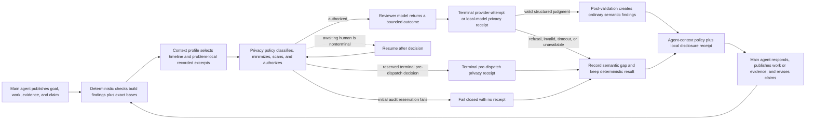

# ADR-006 — Semantic provider profiles behind the privacy gateway

**Status:** Working decision revised 2026-08-30 (issue #404 external-runtime authority). Ratification requires the privacy/egress gates in
ADR-009 plus recorded capability fixtures against every advertised provider/model/endpoint profile.
**Implemented by:** `src/yoetz/ports/semantic.py`,
`src/yoetz/ports/privacy.py`, `src/yoetz/application/egress.py`,
`src/yoetz/application/check.py`, `src/yoetz/adapters/providers/`, `src/yoetz/config/`,
and semantic/privacy capability and conformance tests.

## Decisions

1. **No direct provider path:** application, CLI, MCP, plugin, and integration code cannot call a
   semantic provider. A candidate semantic context must traverse ADR-009's classification, policy,
   local minimization/redaction/secret scan, exact prepared-case approval when required, durable
   authorization, outbound gateway, and privacy-audit path. A provider adapter receives only an immutable
   `ApprovedOutboundCase`; composition supplies no repository, bundle, transcript, environment,
   log, database, keyring, or application-state handle. Standing external evaluation additionally
   requires an exact current grant for the service-derived repository-privacy commitment beneath
   the machine ceiling. A missing or mismatched repository grant fails before provider construction,
   credential-handle minting, authorization, or dispatch.
2. **First external adapter:** official `openai` Python SDK (pinned `2.46.0`), Responses API with
   structured outputs (`responses.parse` + frozen `ProviderJudgmentModel` schema). A release names
   an exact tested provider/model/endpoint-profile tuple. A generic or merely
   "OpenAI-compatible" URL is never trusted as an ambient override. One exact, versioned profile
   kind — `owner-declared-openai-responses` (ADR-014) — may bind an owner-supplied constrained
   HTTPS origin from service TOML (`[provider.owner_declared_endpoint].https_origin`); it reuses
   the Responses protocol cell, never inherits official OpenAI data-use / `assisted` eligibility,
   and still requires capability evidence for any advertised interoperability claim.

   **Amended 2026-07-24; extended 2026-07-27 for the Grok/xAI dogfood path — the
   OpenAI-compatible Chat Completions protocol cell.** Five further exact, versioned profile
   kinds are authorized, each pinned to one host and one fixed path
   prefix, none of them owner-editable: `anthropic-openai-chat-completions`
   (`api.anthropic.com/v1`), `google-gemini-openai-chat-completions`
   (`generativelanguage.googleapis.com/v1beta/openai`), `openrouter-openai-chat-completions`
   (`openrouter.ai/api/v1`), and `xai-openai-chat-completions` (`api.x.ai/v1`) use the
   OpenAI-compatible Chat Completions cell;
   `vercel-ai-gateway-openai-responses` (`ai-gateway.vercel.sh/v1`) reuses the Responses cell and
   needs no adapter of its own. A configurable profile with no runtime factory is not a neutral
   omission — it reports `factory_unavailable` and the requested review silently never runs — so
   each authorized profile resolves to exactly one factory in the dispatch table.

   Structured-output enforcement is recorded per profile from the vendor's own documentation, not
   assumed: a host documented to ignore `response_format` receives the judgment shape in the
   instruction instead, and any answer that is not the exact judgment shape degrades to an honest
   invalid semantic result, never a fabricated pass. None of the five inherits official OpenAI
   data-use or `assisted` eligibility; each carries an unknown data-use record until a reviewed one
   exists. Being dispatchable is not being verified: advertising any of them as a working endpoint
   still requires the exact model/endpoint capability fixture and live evidence E-007 names.
3. **Local-model adapter:** v0.1 includes the contract for a separately configured local semantic
   evaluator. Its endpoint is an owner-only, service-approved AF_UNIX socket profile; it performs no
   DNS, AF_INET/AF_INET6 connection, redirect, proxy lookup, or fallback. It is a local disclosure
   sink, not network egress, but still traverses classification, minimization, never-send scanning,
   and local privacy auditing. A release advertises it only for exact model/endpoint profiles that
   pass capability fixtures.
4. **Credentials:** provider credential bytes are owned by the unlocked local service vault. They
   never enter provider configuration values, CLI/MCP arguments, environment variables, files,
   logs, traces, transcripts, prompts, or LLM context. For each physical dispatch, the gateway
   obtains a fresh service-issued `ProviderCredentialHandle` bound to exact provider/model/endpoint
   profile+version, purpose, authorization-scope digest, purpose digest, dispatch ID, final
   request-body digest, service generation, and deadline. Only the custom HTTP transport may
   consume it through a one-shot header-injection
   callback; the adapter and SDK never receive or retain reusable credential bytes. Under resolved
   decision F-012, the custom transport necessarily sends that separately
   provisioned credential as one-attempt authentication metadata to the exact profile-bound HTTPS
   endpoint selected by the reviewed registry, using platform CA trust and hostname validation,
   never as candidate/model content. v0.1 does not claim certificate or SPKI pinning.
5. **Client policy:** each physical attempt constructs and closes one
   `AsyncOpenAI(base_url=service-resolved exact profile endpoint, timeout=explicit,
   max_retries=0, api_key=fixed_nonsecret_sentinel, http_client=one_attempt_custom_transport)`.
   The adapter renders the exact final application JSON body deterministically. The custom
   transport rejects any actual body digest/profile/deadline mismatch, removes the sentinel header,
   invokes the attempt-bound credential callback only to inject the real authentication header and
   start that one request, then releases the protected view immediately. The privacy commitment is
   over the exact final application body bytes, excluding authentication metadata and HTTP/TLS
   framing. No long-lived SDK client or default-header object holds the real key. Yoetz owns the retry
   budget: at most two retries, only for approved timeout/connection/429 classes, jittered backoff,
   all within one total deadline and one durable semantic operation (per endpoint when a
   fallback endpoint is declared — see the fallback endpoint amendment below). **Amended
   2026-08-29 (issue #348):** inside that same budget and deadline, exactly one repair retry is
   also admitted after `invalid / response_content_invalid` — the provider was reached and its
   answer was incomplete
   or overlong (`failure_class=response_content`, output-token truncation, Chat Completions
   `finish_reason=length`). The repair resubmits the same frozen case under the same authorized
   provider/profile/model/category/retention ceiling with unchanged sampling; it is a new physical
   attempt with fresh dispatch, provider request, authorization, privacy receipt, transport, and
   credential-handle identity, and no provider plaintext is retained. A second content-invalid
   answer is terminal and both attempts remain in accounting. `response_schema_invalid`,
   `semantic_judgment_rejected`, refusal, policy or human denial, invalid case, stale frontier,
   quota exhaustion, secret or never-send detection, and exhausted authority are never retried.
   One durable attempt and one
   privacy receipt, SDK client, custom transport, and credential handle are created per physical
   dispatch. For `confirm_every_request`, each physical retry also requires a fresh exact foreground
   preview/decision and a new one-dispatch proposal; the original human decision cannot cover a
   hidden multi-attempt budget. Crash/resume before authorization consumption remains the same
   attempt. Automatic profiles may retry within their existing policy/total deadline without a
   human prompt, but never reuse authorization or attempt identity.
6. **Required semantic means verdict completeness, not operation availability:** deterministic
   freeze and deterministic results always survive. With `semantic_required`, missing approved
   capability, privacy-policy block, human denial or approval expiry, provider refusal, timeout,
   invalid output, exhausted retry, late response, or stale response completes the check with
   `verdict=incomplete_check`, no semantic findings, and the exact closed
   `(SemanticStatus, SemanticReason)` pair. It does
   not fail the operation or discard deterministic findings. `semantic_if_configured` may complete
   with its deterministic verdict when semantic capability is absent or policy-disabled, while an
   attempted but unsuccessful semantic evaluation is represented honestly in status and coverage.
7. **Provenance has two truthful stages:** the adapter returns bounded
   `ProviderAttemptProvenance` containing only provider/profile/model/request/SDK/digest/usage/
   failure facts it knows at return time. It cannot name a privacy receipt that is not yet closed.
   After the matching terminal `EgressReceipt` or `LocalDisclosureReceipt` is durable, the
   coordinator constructs final `SemanticProvenance` with attempt identity, exact dispatch kind,
   external authorization or local-disclosure reservation, receipt identity, external request
   commitment when applicable, and final status/reason. Only final provenance may be attached to
   a finding or public result. Predispatch gaps have no attempt provenance and remain exactly
   explained by status/reason. Model output is always labeled `semantic_model_derived`.
8. **No raw response retention by default:** success persists only the bounded parsed judgment and
   structural provenance. Refused, malformed, truncated, late, or rejected provider plaintext is
   not retained merely for debugging. If a future opt-in encrypted diagnostic capture is added, it
   requires its own explicit local-human authorization and retention policy; it is not part of the
   v0.1 semantic contract.
9. **Fake provider:** `adapters/providers/fake.py` is a scripted implementation behind the same
   policy-enforcing gateway. It supports results, delays, denials, refusals, malformed output, and
   late responses without network access. Tests may not inject the fake downstream of the gateway
   when claiming privacy-path coverage.
10. **In-process adapter trust limit:** v0.1 loads only reviewed bundled adapters selected by the
    closed registry; third-party/plugin provider adapters and dynamic adapter paths are absent.
    Approved-case types and dependency injection remove ambient capabilities from normal
    composition, and tests can prove the bundled adapter does not use forbidden APIs. They do not
    create an OS/process sandbox: malicious or compromised Python code running inside the trusted
    service could exercise the active user's ambient authority. Process/native sandboxing remains a
    separate stronger architecture option, not a v0.1 privacy claim.
11. **Review context is a separate policy dimension:** `PrivacyProfile` answers whether and how a
    model disclosure is authorized. `ReviewContextProfile` answers which useful facts the case
    builder selects before privacy enforcement. The closed values are `structural`, `goal_aware`,
    `assisted`, `expanded`, and `custom`. The official CLI recommends `assisted` only after the
    user selects and confirms an exact provider, repository scope, categories, classes, and limits.
    Repository scope is derived by the trusted service from the client session's actual working
    directory, never from model-controlled `workspace_ref`: branches and linked worktrees resolve to
    one Git common root, while independent clones and unrelated repositories do not share authority.
    The safe installation seed remains zero-egress `local_only`; a recommendation is never implicit
    consent.
12. **The recommended packet is rich but problem-local:** `assisted` contains the task goal,
    obligations, current completion/material claims, accepted decisions, a material ordered
    timeline, deterministic findings and their machine-readable bases, change-observation facts,
    coverage gaps, and bounded linked test/failure/evidence/source excerpts. The frozen case retains
    the newest 64 material accepted events in ingestion order with at most 512 KiB of canonical
    payload. Newest payloads win that byte budget; retained over-budget events are `not_selected`,
    older events are represented by an exact omitted-before count, and legacy cases state
    `not_recorded`. A source excerpt must
    already be captured or agent-published in the frozen case and must be linked to the reviewed
    claim, obligation, finding, action, result, or evidence. The case builder has no live Git or
    filesystem browser and never upgrades missing content into observed content. `expanded` and
    `custom` may select more *already recorded* in-scope material, but no profile grants ambient
    repository access or defeats the existing item/case caps.
13. **Reviewer output talks to the main agent through the existing workflow:** a successful model
    judgment may propose bounded `ReviewerChallenge` values. Each challenge names only case-bound
    refs, explains the discrepancy, states an alternative interpretation, addresses the main agent
    directly, and requests the smallest next step: act, provide evidence, revise the claim, dispute
    with evidence, or state an unresolved limitation. Post-validation maps an accepted challenge to
    the existing semantic `Finding.summary/detail`; the main agent uses the existing `respond` and
    `publish_work` operations, then runs `check` again. There is no provider-driven fetch loop, new
    event family, seventh public operation, or model waiver authority.
14. **Recommendation eligibility is evidence-bound, not a brand promise:** every installed external
    endpoint profile carries a versioned data-use record stating customer-content training use,
    retention posture, provider-human-access posture, review/expiry times, and an evidence digest.
    The upstream `assisted` badge requires a current record with training `prohibited`, retention
    `none|bounded` with any bounded ceiling at most 30 days. Provider human-access posture and
    documented safety, support, legal, and abuse-monitoring exceptions remain mandatory disclosure
    facts, but do not replace or silently raise that recommendation threshold.
    The recommended recipe also sets an editable
    `require_current_provider_data_use_evidence=true` runtime guard. Yoetz does not technically
    prove provider behavior. Unknown, known-broad, or stale status removes the recommendation badge
    and trips that guard; an informed user may explicitly turn the guard off through a custom policy,
    and a fork may change the rule without inheriting upstream privacy/support evidence.

## Review packet and agent loop

The stable provider instruction is equivalent to:

> Review only the supplied packet against the stated goal and obligations. Treat main-agent claims,
> deterministic observations, and unavailable content as different facts. Never say no code changed
> merely because no excerpt was disclosed. If a material discrepancy exists, address the main agent
> directly, explain why, cite only supplied references, offer the strongest plausible alternative,
> and request the smallest evidence or action that would resolve it. Do not waive policy, invent
> repository facts, or claim deterministic authority.

The packet varies by `ReviewContextProfile`: `structural` contains only typed timeline/status/state/
coverage facts; `goal_aware` adds detailed, category-separated frozen plan, obligation, claim,
decision, action, result, evidence, finding, response, and check history; `assisted` additionally
adds problem-local recorded evidence, failure, test, diff, and repository excerpts; `expanded` or
`custom` can include a broader explicitly approved recorded set. Exact command text remains
excluded unless independently selected. Every variant distinguishes `not_recorded`, `not_selected`,
`withheld_by_policy`, and `redacted_never_send`; a history-window item carries the exact older-event
count.

## Deterministic fencing

The semantic case is built from a frozen frontier and dependency digest. It carries separate
`frontier_refs` (IDs present at the frozen frontier) and `local_check_refs` (deterministic finding
IDs allocated and durably pinned by this check); their union is bound into the case digest. This
lets the reviewer discuss deterministic findings without pretending those post-frontier IDs were
already in the ledger. Every deterministic finding carries a paired `FindingBasis` containing the
rule ID, triggering observed facts, required-but-missing facts, subject-state relation, source
availability, coverage gaps, and bounded supporting refs. Later disclosure-time
`ChangeObservation` and content-visibility facts remain separate. `same`, `different`, and
`unknown` retain their exact three-valued meaning; hidden or unrecorded source is never represented
as `same`.

Approval is bound to the exact minimized case digest, provider/model/endpoint profile, purpose,
composed machine/repository/task/request authority, policy version, and one dispatch. The provider
is called outside every SQLite transaction.
Post-validation rejects invented IDs, out-of-case quotes, coverage upgrades, deterministic-status
claims, challenges without a material discrepancy or requested next step, and stale frontiers.
Rejected output never projects a finding.

## Codex subscription-runtime amendment (2026-08-30, issue #404)

External semantic authentication has two authorities. Existing HTTP profiles
use `yoetz_vault_api_credential`. The exact `codex-chatgpt-subscription@1` profile uses
`external_runtime_oauth`: one selected OpenAI Codex app-server owns ChatGPT login, refresh,
credential storage, model discovery, and the upstream OpenAI request. Yoetz never reads or imports
that credential. The only fallback behind this profile is the other declared authority — an
exact API-provider binding paired under the fallback endpoint amendment below (2026-09-04,
issue #582) — never an API key read from the environment, a generic endpoint, a proxy, or an
ambient Codex home. Until that amendment the two authorities were mutually exclusive in
configuration.

The initial closed compatibility cell is Codex npm `0.150.1` on macOS arm64, app-server v2 over
stdio JSONL, with an exact native executable digest, protocol-schema digest, digest-bound isolated
configuration, model, reasoning effort, and `codex-evaluator/0.150.1/v1` capability identity. A
capability-cell identity digest and evidence expiry are bound separately; an expired cell cannot
launch a child. A neighboring version, changed binary/config, absent ChatGPT login, unavailable
exact model/reasoning cell, or unproved isolation fails before case disclosure. This cell has
unknown data-use posture and receives no Assisted recommendation badge.

The gateway issues a secret-free, dispatch-bound `ExternalRuntimeAuthority` instead of minting a
vault handle. The runtime may receive only the already-approved canonical case through stdin. Its
`RuntimeAttemptEvidence` commits to the disclosed case, instruction, output schema, launcher,
configuration, executable, protocol, capability, model/reasoning selection, safe correlation,
terminal output digest, and process cleanup. It explicitly records
`upstream_body_observability=unavailable`; the disclosed-case commitment must never be described as
the upstream OpenAI body.

Retries remain within the durable attempt budget. A pre-`turn/start`-acknowledgement transient may
receive a fresh one-use authorization and exact retry. After acknowledgement, transport ambiguity
or unconfirmed process-group cleanup is terminal `unavailable/outcome_unknown` and is never
automatically retried. Schema-valid model output remains advisory and follows the unchanged
post-validation/finding path.

## Fallback endpoint amendment (2026-09-04, issue #582)

Semantic review may bind one primary endpoint plus exactly one fallback endpoint. The pairing is
exactly the two external authorities above: the API provider (`[provider]`,
`yoetz_vault_api_credential`) and the Codex ChatGPT subscription evaluator (`[external_runtime]`,
`external_runtime_oauth`). A nonsecret `[semantic_fallback]` table with
`primary = "api_provider"` or `primary = "codex_subscription"` names which serves first; the other
bound table is the fallback. Two API providers cannot pair, a generic or owner-declared endpoint is
never an implicit fallback, and there is no third slot. `profile` must agree with the primary
(`local-openai` for the API provider, `codex-subscription` for the subscription); a pairing with a
table missing fails as `semantic_fallback_endpoint_missing`, a disagreeing profile as
`semantic_fallback_profile_mismatch`. Removing the fallback restores the exact single-endpoint
configuration; swapping the primary keeps both bindings and both approvals.

1. **Closed engagement rule.** The primary is given up for the fallback only for the closed
   fallback-licensing set — `timeout/provider_timeout`, `unavailable/transport_unavailable`,
   `unavailable/provider_rate_limited`, `unavailable/provider_quota_exhausted` — and only after
   two such failures (`FALLBACK_PRIMARY_FAILURE_LIMIT = 2`, not owner-configurable), one quota
   exhaustion, or the primary's own exhausted retry budget. A primary that cannot be resolved
   before dispatch (`credential_unavailable`) hands every attempt to the fallback with zero
   primary attempts recorded. Content-shaped outcomes — `response_content_invalid` including its
   issue #348 repair retry, `response_schema_invalid`, refusal, `semantic_judgment_rejected` —
   policy and human outcomes, and `outcome_unknown` never engage the fallback: the primary
   answered, or may have, and a second destination cannot repair a content answer. Once engaged,
   a job never returns to the primary.
2. **Per-endpoint budgets.** Each endpoint keeps its own decision-5 retry budget (at most two
   retries) and its own configured timeout; primary failures never spend the fallback's budget.
   The operation deadline is the primary timeout plus the fallback timeout, so a primary that
   spends its whole timeout failing still leaves the fallback room to run. A single fallback
   failure keeps its exact reason rather than reading as an exhausted budget it never had.
3. **Replay-safe endpoint selection.** Which endpoint an attempt uses is a pure function of the
   durable attempt rows before it, never coordinator memory; crash, restart, and
   `awaiting_human` replay resume the endpoint the attempt was claimed for.
4. **Every fallback attempt is a fresh physical attempt** under ADR-009: its own privacy
   evaluation against the exact fallback binding, authorization, dispatch identity, credential
   handle or `ExternalRuntimeAuthority`, and privacy receipt. Under `confirm_every_request` it
   needs its own foreground preview and decision. Nothing approved for the primary is reused.
5. **Provenance names both endpoints.** `SemanticProvenance.fallback_from` (provider, endpoint
   profile id and version, model, `attempted_count`, `reason`) is present exactly when the
   fallback served; the top-level provider/model/endpoint then name the fallback and
   `fallback_from` names the primary, its physical attempts before engagement, and its last
   closed failure reason (`semantic-provenance-1.1.0`, append-only). It appears in check results,
   check-recorded events, findings, and JSON receipts; markdown and text receipts name the
   endpoint that served and the primary's closed failure reason. Attempt accounting carries one
   per-endpoint slice.
6. **Readiness and capability.** `yoetz provider status` reports `endpoint` (role `primary`) and,
   with a pairing, `fallback_endpoint` plus `fallback_credential_connected` and a separate
   `fallback_provider_credential` blocker; the service advertises a `fallback_provider`
   capability when the fallback's credential is structurally present. The fallback's credential
   never gates the primary and `semantic_ready` never depends on it. The pairing is a
   service-side dispatch decision with no host-specific behaviour; ADR-018's route ceiling
   applies to dispatch authority regardless of which endpoint serves.

Consequences: the Assisted recommendation rule reads the primary endpoint's data-use record, and
setup asks for `require_current_provider_data_use_evidence` only when every bound endpoint has a
reviewed record — the requirement is enforced per dispatch, so a fallback with unknown posture
would otherwise be policy-denied at the one moment the pairing exists for. The subscription cell
has unknown data-use posture whichever role it holds, so an attempt it serves carries no
upstream no-training claim. A fallback whose factory cannot be built or whose
credential is absent is reported unavailable on its own row without fencing the primary. No live
interoperability of a paired dispatch is claimed until authorized evidence records the exact
request, response, route, and receipt for the endpoint that served.
