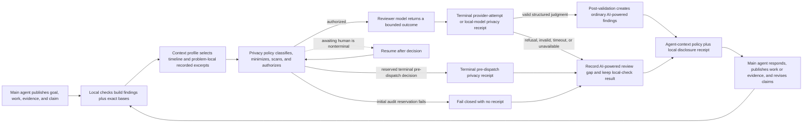

# ADR-006 — AI-powered review provider profiles behind the privacy gateway

**Status:** Working decision revised 2026-08-30 (issue #404 external-runtime authority). Amended
2026-09-23 for issue #742 (adapter-boundary failure tokens, credential-retry exclusion, and
attempt-status projection). Ratification requires the privacy/egress gates in
ADR-009 plus recorded capability fixtures against every advertised provider/model/endpoint profile.
**Implemented by:** `src/yoetz/ports/semantic.py`,
`src/yoetz/ports/privacy.py`, `src/yoetz/application/egress.py`,
`src/yoetz/application/check.py`, `src/yoetz/adapters/providers/`, `src/yoetz/config/`,
and AI-powered review/privacy capability and conformance tests.

## Decisions

1. **No direct provider path:** application, CLI, MCP, plugin, and integration code cannot call an
   AI-powered review provider. A candidate AI-powered review context must traverse ADR-009's
   classification, policy, local minimization/redaction/secret scan, exact prepared-case approval
   when required, durable authorization, outbound gateway, and privacy-audit path. A provider
   adapter receives only an immutable `ApprovedOutboundCase`; composition supplies no repository,
   bundle, transcript, environment, log, database, keyring, or application-state handle. Standing
   external evaluation additionally requires an exact current grant for the service-derived
   repository-privacy commitment beneath the machine ceiling. A missing or mismatched repository
   grant fails before provider construction, credential-handle minting, authorization, or dispatch.
2. **First external adapter:** official `openai` Python SDK (pinned `2.46.0`), Responses API with
   structured outputs (`responses.parse` + frozen `ProviderJudgmentModel` schema). A release names
   an exact tested provider/model/endpoint-profile tuple. A generic or merely
   "OpenAI-compatible" URL is never trusted as an ambient override. One exact, versioned profile
   kind — `owner-declared-openai-responses` (ADR-014) — may bind an owner-supplied constrained
   HTTPS origin from service TOML (`[provider.owner_declared_endpoint].https_origin`); it reuses
   the Responses protocol cell, never inherits official OpenAI data-use / `assisted` eligibility,
   and still requires capability evidence for any advertised interoperability claim.

   **Amended 2026-07-24; extended 2026-07-27 for the Grok/xAI dogfood path — the
   OpenAI-compatible Chat Completions protocol cell.** Five further exact, versioned profile
   kinds are authorized, each pinned to one host and one fixed path
   prefix, none of them owner-editable: `anthropic-openai-chat-completions`
   (`api.anthropic.com/v1`), `google-gemini-openai-chat-completions`
   (`generativelanguage.googleapis.com/v1beta/openai`), `openrouter-openai-chat-completions`
   (`openrouter.ai/api/v1`), and `xai-openai-chat-completions` (`api.x.ai/v1`) use the
   OpenAI-compatible Chat Completions cell;
   `vercel-ai-gateway-openai-responses` (`ai-gateway.vercel.sh/v1`) reuses the Responses cell and
   needs no adapter of its own. A configurable profile with no runtime factory is not a neutral
   omission — it reports `factory_unavailable` and the requested review silently never runs — so
   each authorized profile resolves to exactly one factory in the dispatch table.

   Structured-output enforcement is recorded per profile from the vendor's own documentation, not
   assumed: a host documented to ignore `response_format` receives the judgment shape in the
   instruction instead, and any answer that is not the exact judgment shape degrades to an honest
   invalid AI-powered review result, never a fabricated pass. None of the five inherits official
   OpenAI data-use or `assisted` eligibility; each carries an unknown data-use record until a
   reviewed one exists. Being dispatchable is not being verified: advertising any of them as a
   working endpoint still requires the exact model/endpoint capability fixture and live evidence
   E-007 names.
3. **Local-model adapter:** v0.1 includes the contract for a separately configured locally hosted
   AI-powered evaluator. Its endpoint is an owner-only, service-approved AF_UNIX socket profile; it
   performs no DNS, AF_INET/AF_INET6 connection, redirect, proxy lookup, or fallback. It is a local
   disclosure sink, not network egress, but still traverses classification, minimization, never-send
   scanning, and local privacy auditing. A release advertises it only for exact model/endpoint
   profiles that pass capability fixtures.
4. **Credentials:** provider credential bytes are owned by the unlocked local service vault. They
   never enter provider configuration values, CLI/MCP arguments, environment variables, files,
   logs, traces, transcripts, prompts, or LLM context. For each physical dispatch, the gateway
   obtains a fresh service-issued `ProviderCredentialHandle` bound to exact provider/model/endpoint
   profile+version, purpose, authorization-scope digest, purpose digest, dispatch ID, final
   request-body digest, service generation, and deadline. Only the custom HTTP transport may
   consume it through a one-shot header-injection
   callback; the adapter and SDK never receive or retain reusable credential bytes. Under resolved
   decision F-012, the custom transport necessarily sends that separately
   provisioned credential as one-attempt authentication metadata to the exact profile-bound HTTPS
   endpoint selected by the reviewed registry, using platform CA trust and hostname validation,
   never as candidate/model content. v0.1 does not claim certificate or SPKI pinning.
5. **Client policy:** each physical attempt constructs and closes one
   `AsyncOpenAI(base_url=service-resolved exact profile endpoint, timeout=explicit,
   max_retries=0, api_key=fixed_nonsecret_sentinel, http_client=one_attempt_custom_transport)`.
   The adapter renders the exact final application JSON body deterministically. The custom
   transport rejects any actual body digest/profile/deadline mismatch, removes the sentinel header,
   invokes the attempt-bound credential callback only to inject the real authentication header and
   start that one request, then releases the protected view immediately. The privacy commitment is
   over the exact final application body bytes, excluding authentication metadata and HTTP/TLS
   framing. No long-lived SDK client or default-header object holds the real key. Yoetz owns the retry
   budget: at most two retries, only for approved timeout/connection/429 classes, jittered backoff,
   all within one total deadline and one durable AI-powered review operation (per endpoint when a
   fallback endpoint is declared — see the fallback endpoint amendment below). **Amended
   2026-08-29 (issue #348):** inside that same budget and deadline, exactly one repair retry is
   also admitted after `invalid / response_content_invalid` — the provider was reached and its
   answer was incomplete
   or overlong (`failure_class=response_content`, output-token truncation, Chat Completions
   `finish_reason=length`). The repair resubmits the same frozen case under the same authorized
   provider/profile/model/category/retention ceiling with unchanged sampling; it is a new physical
   attempt with fresh dispatch, provider request, authorization, privacy receipt, transport, and
   credential-handle identity, and no provider plaintext is retained. A second content-invalid
   answer is terminal and both attempts remain in accounting. `response_schema_invalid`,
   `semantic_judgment_rejected`, refusal, policy or human denial, invalid case, stale frontier,
   quota exhaustion, secret or never-send detection, exhausted authority, and a rejected
   credential (`failure_class=authentication` or `authorization`) are never retried. A rejected
   credential may still surface as public reason `transport_unavailable` — the transport catch-all
   — so retry consults the recorded `failure_class`, not the public reason alone (issue #742).
   The same class also vetoes fallback engagement: a rejected primary credential ends the job
   rather than dispatching the case to the fallback endpoint.
   One durable attempt and one
   privacy receipt, SDK client, custom transport, and credential handle are created per physical
   dispatch. For `confirm_every_request`, each physical retry also requires a fresh exact foreground
   preview/decision and a new one-dispatch proposal; the original human decision cannot cover a
   hidden multi-attempt budget. Crash/resume before authorization consumption remains the same
   attempt. Automatic profiles may retry within their existing policy/total deadline without a
   human prompt, but never reuse authorization or attempt identity.
6. **Required AI-powered review means verdict completeness, not operation availability:**
   local-check freeze and local-check results always survive. With `semantic_required`, missing
   approved capability, privacy-policy block, human denial or approval expiry, provider refusal,
   timeout, invalid output, exhausted retry, late response, or stale response completes the check
   with `verdict=incomplete_check`, no AI-powered findings, and the exact closed `(SemanticStatus,
   SemanticReason)` pair. It does not fail the operation or discard local findings.
   `semantic_if_configured` may complete with its local-check verdict when AI-powered review
   capability is absent or policy-disabled, while an attempted but unsuccessful AI-powered
   evaluation is represented honestly in status and coverage.
7. **Provenance has two truthful stages:** the adapter returns bounded
   `ProviderAttemptProvenance` containing only provider/profile/model/request/SDK/digest/usage/
   failure facts it knows at return time. It cannot name a privacy receipt that is not yet closed.
   After the matching terminal `EgressReceipt` or `LocalDisclosureReceipt` is durable, the
   coordinator constructs final `SemanticProvenance` with attempt identity, exact dispatch kind,
   external authorization or local-disclosure reservation, receipt identity, external request
   commitment when applicable, and final status/reason. Only final provenance may be attached to
   a finding or public result. Predispatch gaps have no attempt provenance and remain exactly
   explained by status/reason. Model output is always labeled `semantic_model_derived`.
8. **No raw response retention by default:** success persists only the bounded parsed judgment and
   structural provenance. Refused, malformed, truncated, late, or rejected provider plaintext is
   not retained merely for debugging. If a future opt-in encrypted diagnostic capture is added, it
   requires its own explicit local-human authorization and retention policy; it is not part of the
   v0.1 AI-powered review contract.
9. **Fake provider:** `adapters/providers/fake.py` is a scripted implementation behind the same
   policy-enforcing gateway. It supports results, delays, denials, refusals, malformed output, and
   late responses without network access. Tests may not inject the fake downstream of the gateway
   when claiming privacy-path coverage.
10. **In-process adapter trust limit:** v0.1 loads only reviewed bundled adapters selected by the
    closed registry; third-party/plugin provider adapters and dynamic adapter paths are absent.
    Approved-case types and dependency injection remove ambient capabilities from normal
    composition, and tests can prove the bundled adapter does not use forbidden APIs. They do not
    create an OS/process sandbox: malicious or compromised Python code running inside the trusted
    service could exercise the active user's ambient authority. Process/native sandboxing remains a
    separate stronger architecture option, not a v0.1 privacy claim.
11. **Review context is a separate policy dimension:** `PrivacyProfile` answers whether and how a
    model disclosure is authorized. `ReviewContextProfile` answers which useful facts the case
    builder selects before privacy enforcement. The closed values are `structural`, `goal_aware`,
    `assisted`, `expanded`, and `custom`. The official CLI recommends `assisted` only after the
    user selects and confirms an exact provider, repository scope, categories, classes, and limits.
    Repository scope is derived by the trusted service from the client session's actual working
    directory, never from model-controlled `workspace_ref`: branches and linked worktrees resolve to
    one Git common root, while independent clones and unrelated repositories do not share authority.
    The safe installation seed remains zero-egress `local_only`; a recommendation is never implicit
    consent.
12. **The recommended packet is rich but problem-local:** `assisted` contains the task goal,
    obligations, current completion/material claims, accepted decisions, a material ordered
    timeline, local findings and their machine-readable bases, change-observation facts,
    coverage gaps, and bounded linked test/failure/evidence/source excerpts. The frozen case retains
    the newest 64 material accepted events in ingestion order with at most 512 KiB of canonical
    payload. Newest payloads win that byte budget; retained over-budget events are `not_selected`,
    older events are represented by an exact omitted-before count, and legacy cases state
    `not_recorded`. A source excerpt must
    already be captured or agent-published in the frozen case and must be linked to the reviewed
    claim, obligation, finding, action, result, or evidence. The case builder has no live Git or
    filesystem browser and never upgrades missing content into observed content. `expanded` and
    `custom` may select more *already recorded* in-scope material, but no profile grants ambient
    repository access or defeats the existing item/case caps.
    Native edit arguments from Codex, Claude Code and Cursor may enter this lane as dedicated
    diff/changed-file content, using only recognized visible patch or replacement fields, captured
    once from the post-tool event and labelled with the host-reported outcome (`applied`, `failed`
    or `unknown`). Unknown nested fields are excluded, and every file locator in the edit, including
    patch headers, is made workspace-relative or masked as `<outside-workspace>` (POSIX, Windows
    drive, UNC and WSL `/mnt/<drive>` spellings alike). Capture consent, secret scanning, outbox
    admission, generation fences and disclosure approval remain required. Claim-linked evidence
    wins selection first, then captured edits (newest first), then other captures, including before
    bounded object resolution; a selected capture outside the latest-256 envelope window is read by
    exact content reference or disclosed as `content_unselected`. Shell heredoc edits whose new
    bytes are in the command (`apply_patch`/`git apply`/`cat >`/`tee` heredocs) are captured the same
    way; script-mediated edits are not. Authenticated
    code is split into UTF-8-safe items within the existing per-item, item-count and total-byte caps;
    a delivered prefix reports `truncated_payload`, and excluded retained content reports
    `content_unselected`. These captures are not a Git snapshot. The one repository read is the
    check-time change of ADR-031: when the recipe selects diff excerpts, the service (never the
    case builder) captures the change from the task-start commit to the working tree once per
    check and the packet reserves room for it ahead of other excerpts, as `repository_excerpt`
    items the inference channel must allow. A digest alone cannot supply missing code.
13. **Reviewer output talks to the main agent through the existing workflow:** a successful model
    judgment may propose bounded `ReviewerChallenge` values. Each challenge names only case-bound
    refs, explains the discrepancy, states an alternative interpretation, addresses the main agent
    directly, and names the repair or the exact missing artifact that would resolve it, with one
    requested response: act, provide evidence, revise the claim, dispute with evidence, or state an
    unresolved limitation (issue #906). Post-validation maps an accepted challenge to
    the existing AI-powered `Finding.summary/detail`; the main agent uses the existing `respond` and
    `publish_work` operations, then runs `check` again. There is no provider-driven fetch loop, new
    event family, seventh public operation, or model waiver authority.
14. **Recommendation eligibility is evidence-bound, not a brand promise:** every installed external
    endpoint profile carries a versioned data-use record stating customer-content training use,
    retention posture, provider-human-access posture, review/expiry times, and an evidence digest.
    The upstream `assisted` badge requires a current record with training `prohibited`, retention
    `none|bounded` with any bounded ceiling at most 30 days. Provider human-access posture and
    documented safety, support, legal, and abuse-monitoring exceptions remain mandatory disclosure
    facts, but do not replace or silently raise that recommendation threshold.
    The recommended recipe also sets an editable
    `require_current_provider_data_use_evidence=true` runtime guard. Yoetz does not technically
    prove provider behavior. Unknown, known-broad, or stale status removes the recommendation badge
    and trips that guard; an informed user may explicitly turn the guard off through a custom policy,
    and a fork may change the rule without inheriting upstream privacy/support evidence.
15. **Adapter classification and attempt-status projection (issue #742):** every provider
    failure is classified at the adapter boundary into the closed `SemanticFailureClass` set.
    Public `SemanticReason` values stay the existing closed pair vocabulary; renderers resolve
    recovery through `continuation_for_semantic_outcome` from that pair plus `failure_class`.
    A successful review with zero findings is `semantic_status=succeeded` /
    `semantic_reason=semantic_completed` on the check path, and `semantic_state=ready` on
    advice/status/history. That ready state is derived from the recorded attempt (an addon
    whose `failure_reason` is absent), never from finding count. Absence of
    `semantic_model_derived` advice items is not evidence that no attempt occurred.
    `disabled` means no attempt was requested or configured; `unavailable` means a durable
    attempt is still pending; `failed` means a terminal attempt finished without validated
    output, including a succeeded attempt whose output failed advice-side validation and left
    no usable finding. The state is an attempt fact only: advice coverage still adds
    `semantic_model_derived` only for validated finding ids, so a zero-finding review is `ready`
    without claiming that check type. A snapshot stored before this amendment has no recorded
    state and reads as `ready` when it holds AI-powered items, otherwise `disabled`.
    Predispatch configuration and policy outcomes carry no recovery directive. Frozen
    check-result schemas are unchanged.

## Review packet and agent loop

```mermaid
flowchart LR
    A["Main agent publishes goal, work, evidence, and claim"] --> B["Local checks build findings plus exact bases"]
    B --> C["Context profile selects timeline and problem-local recorded excerpts"]
    C --> D["Privacy policy classifies, minimizes, scans, and authorizes"]
    D -->|"authorized"| E["Reviewer model returns a bounded outcome"]
    E --> H["Terminal provider-attempt or local-model privacy receipt"]
    H -->|"valid structured judgment"| F["Post-validation creates ordinary AI-powered findings"]
    H -->|"refusal, invalid, timeout, or unavailable"| K["Record AI-powered review gap and keep local-check result"]
    F --> J["Agent-context policy plus local disclosure receipt"]
    K --> J
    J --> G["Main agent responds, publishes work or evidence, and revises claims"]
    G --> B
    D -->|"reserved terminal pre-dispatch decision"| R["Terminal pre-dispatch privacy receipt"]
    D -->|"initial audit reservation fails"| X["Fail closed with no receipt"]
    R --> K
    X --> K
    D -.->|"awaiting human is nonterminal"| I["Resume after decision"]
    I --> D
```

The stable provider instruction (one source for every provider path, issue #906) is equivalent to:

> You are the requested review: verify the change against the task and the recorded verification
> against the change, from the supplied packet only. Yoetz's own check, finding, receipt, and
> coverage state, and any obligation to obtain this review, are never defects in the work; a work
> obligation left open under a completion claim still is. Treat main-agent claims, deterministic
> observations, and unavailable content as different facts. Never say no code changed merely
> because no excerpt was disclosed. Judge recorded output yourself instead of asking for a re-run.
> Report every distinct material problem, address the main agent directly, cite only supplied
> references, offer the strongest plausible alternative, and name the repair or the exact missing
> artifact. Never request environment changes. Do not waive policy, invent repository facts, claim
> deterministic authority, or claim stronger coverage than the packet.

The packet varies by `ReviewContextProfile`: `structural` contains only typed timeline/status/state/
coverage facts; `goal_aware` adds detailed, category-separated frozen plan, obligation, claim,
decision, action, result, evidence, finding, response, and check history; `assisted` additionally
adds problem-local recorded evidence, failure, test, diff, and repository excerpts; `expanded` or
`custom` can include a broader explicitly approved recorded set. Exact command text remains
excluded unless independently selected. Every variant distinguishes `not_recorded`, `not_selected`,
`withheld_by_policy`, and `redacted_never_send`; a history-window item carries the exact older-event
count.

## Local-check fencing

The AI-powered review case is built from a frozen frontier and dependency digest. It carries
separate `frontier_refs` (IDs present at the frozen frontier) and `local_check_refs` (local finding
IDs allocated and durably pinned by this check); their union is bound into the case digest. This
lets the reviewer discuss local findings without pretending those post-frontier IDs were already in
the ledger. Every local finding carries a paired `FindingBasis` containing the rule ID, triggering
observed facts, required-but-missing facts, subject-state relation, source availability, coverage
gaps, and bounded supporting refs. Later disclosure-time `ChangeObservation` and content-visibility
facts remain separate. `same`, `different`, and `unknown` retain their exact three-valued meaning;
hidden or unrecorded source is never represented as `same`.

Approval is bound to the exact minimized case digest, provider/model/endpoint profile, purpose,
composed machine/repository/task/request authority, policy version, and one dispatch. The provider
is called outside every SQLite transaction.
Post-validation rejects invented IDs, out-of-case quotes, coverage upgrades, local-check-status
claims, challenges without a material discrepancy or requested next step, and stale frontiers.
Rejected output never projects a finding.

## Codex subscription-runtime amendment (2026-08-30, issue #404)

External AI-powered review authentication has two authorities. Existing HTTP profiles
use `yoetz_vault_api_credential`. The exact `codex-chatgpt-subscription@1` profile uses
`external_runtime_oauth`: one selected OpenAI Codex app-server owns ChatGPT login, refresh,
credential storage, model discovery, and the upstream OpenAI request. Yoetz never reads or imports
that credential. The only fallback behind this profile is the other declared authority — an
exact API-provider binding paired under the fallback endpoint amendment below (2026-09-04,
issue #582) — never an API key read from the environment, a generic endpoint, a proxy, or an
ambient Codex home. Until that amendment the two authorities were mutually exclusive in
configuration.

The initial closed compatibility cell is Codex npm `0.150.1` on macOS arm64, app-server v2 over
stdio JSONL, with an exact native executable digest, protocol-schema digest, digest-bound isolated
configuration, model, reasoning effort, and `codex-evaluator/0.150.1/v1` capability identity. A
capability-cell identity digest and evidence expiry are bound separately; an expired cell cannot
launch a child. A neighboring version, changed binary/config, absent ChatGPT login, unavailable
exact model/reasoning cell, or unproved isolation fails before case disclosure. This cell has
unknown data-use posture and receives no Assisted recommendation badge.

The September 7, 2026 amendment for issue #584 pins `codex-evaluator/0.150.1/v2` to the same
native binary, schema, configuration, and expiry. It accepts the pinned schema's sparse rate-limit
bookkeeping independently of bucket name; malformed bookkeeping after acknowledgement records
only a bounded nonterminal diagnostic. Native quota and 429 errors remain authoritative. Tool
and unreviewed event failures stay terminal but are unavailable rather than invalid model answers.
The runbook records the exact new cell digest and synthetic evidence boundary. Existing bindings
require explicit setup to accept the new identity; no privacy authority migrates implicitly.

### Linux x86_64 cell amendment (2026-09-13, issue #716)

The same evaluator contract now has a separate Linux x86_64 implementation cell for Codex npm
`0.150.1-linux-x64` (`@openai/codex-linux-x64`). Its native executable, source identity, package
layout, platform, and capability-cell digest are distinct from the macOS arm64 cell; its app-server
v2 schema, isolated configuration, model/reasoning contract, OAuth authority, and privacy/cleanup
fences remain identical. An x86_64 WSL2 Linux userspace is eligible for the Linux cell, but
WSL-specific smoke evidence is pending; this amendment creates no native Windows cell. The Linux
cell remains an implementation candidate until its packaged Yoetz lifecycle and AI-powered review
receipt evidence is complete. The empty `runtime-support.json` arrays therefore remain unchanged.

The gateway issues a secret-free, dispatch-bound `ExternalRuntimeAuthority` instead of minting a
vault handle. The runtime may receive only the already-approved canonical case through stdin. Its
`RuntimeAttemptEvidence` commits to the disclosed case, instruction, output schema, launcher,
configuration, executable, protocol, capability, model/reasoning selection, safe correlation,
terminal output digest, and process cleanup. It explicitly records
`upstream_body_observability=unavailable`; the disclosed-case commitment must never be described as
the upstream OpenAI body. Current runtime evidence may also record the Codex app-server's bounded
cumulative token snapshot for that exact thread and turn: input/output/total counters plus cached
input and reasoning-output subsets, with cache-write input retained as a separate provider
counter. Repeated cumulative updates replace one another; they are never summed, and missing,
malformed, unrelated, or regressing updates remain
unknown or become a bounded `token_usage_invalid` diagnostic. Account identifiers and raw provider
notification bodies never enter provenance.

For the same reason, each observed `RuntimeTokenUsage` sample is copied into the corresponding
`semantic_attempts` ledger row as six bounded numeric counters before the attempt is closed. The
nullable columns preserve older ledgers and keep cache-write and reasoning subsets separate; a
partial or invariant-breaking sample fails closed. Internal attempt accounting for an operation
that is still in flight can thus recover usage for selected, failed, and expired physical attempts
across a service restart, while public provenance continues to describe only the provider result
it actually represents and never invents provenance for a failed recovery. Usage for attempts of
already-completed operations stays in the owner ledger rows and reaches no public surface. A
failure while persisting a successful response is terminalized as a bounded
`coordinator_failure` with the attempt's usage retained, rather than leaving the attempt
`started`.

Retries remain within the durable attempt budget. A pre-`turn/start`-acknowledgement transient may
receive a fresh one-use authorization and exact retry. After acknowledgement, transport ambiguity
or unconfirmed process-group cleanup is terminal `unavailable/outcome_unknown` and is never
automatically retried. Schema-valid model output remains advisory and follows the unchanged
post-validation/finding path.

### Evaluator runtime retention and repair amendment (2026-09-26, issue #855)

Binding the exact cell to an ordinary host installation coupled AI-powered review to the host's
package manager: a routine Codex update replaced the bytes at the bound path, and a capability
identity change (the #584 v1 → v2 transition) stranded a valid login behind an outdated binding.
Both failed before dispatch and surfaced only as `credential_unavailable`. This amendment keeps
exact-version admission and separates the **evaluator runtime** from the **host installation**.

1. **Admission is unchanged.** Each platform cell still admits exactly one reviewed native
   executable digest. No newer Codex release is admitted, and nothing is inferred from a version
   string, path, or discovery order. Capability-based admission of further releases stays future
   work that needs its own evidence and amendment.
2. **A retained runtime per data bundle.** Setup and repair bind an owner-private copy at
   `<data bundle>/external-runtimes/codex-evaluator/<source identity>/codex` (directory `0700`,
   file `0500`). Bytes are hashed while they are copied and committed by atomic replace only when
   they equal the admitted digest; the unchanged launch fence re-verifies them before every child.
   Host package-manager updates cannot replace the copy, and every instance keeps its own.
3. **Sources for the copy.** A selected local executable that resolves to the admitted cell, or,
   after explicit consent, the operator's own `npm` installing the exact admitted release into an
   owner-private staging prefix with lifecycle scripts disabled. Only the verified native
   executable is kept; the staging prefix is always removed. This is package acquisition under the
   operator's registry settings. No task content, credential, or account data is sent on it, and
   it grants no review egress.
4. **Selection by eligibility.** Setup defaults to the retained copy, then the existing binding's
   executable when it still holds the admitted bytes, then the first discovered installation that
   resolves to the admitted cell. An unadmitted discovered binary is never presented as a default.
5. **Rebinding preserves choices.** Setup and repair preserve the provider role, model, reasoning
   effort, timeout, retry budget, and dedicated home unless the owner explicitly changes one.
   `repair` is the explicit capability-identity transition the #584 amendment requires: it shows the
   changed fields, needs acceptance, and reuses the login only when Codex's own
   `account/read`/`model/list` probe reports the home signed in with the exact model. It never
   starts a sign-in, logs out, or switches accounts, and it writes against the exact configuration
   preimage. Privacy grants are not part of the binding and do not migrate. A missing home, an
   unsafe home, and a modified isolated config are refused for the owner to fix; only a missing
   Yoetz-owned isolated config is restored.
6. **Precise pre-dispatch diagnosis.** A closed structural state is computed from local structure
   only (binding, executable bytes, dedicated home): `codex_runtime_platform_unsupported`,
   `codex_runtime_binding_invalid`, `codex_runtime_capability_evidence_stale`,
   `codex_runtime_capability_unsupported`, `codex_runtime_executable_missing|invalid|changed`,
   `codex_runtime_profile_outdated`, `codex_home_missing|unsafe`,
   `codex_runtime_config_missing|changed`, `codex_runtime_unavailable`, or `ready`. `ready` is
   reported only when the launch fence also accepts the binding. READY composition still spawns no
   app-server. The public semantic outcome is unchanged; a request-joined companion diagnostic names
   the structural state, and `provider status` reports it with its continuation.
7. **Reverse operations stay distinct.** `runtime remove` refuses while the binding uses the copy.
   Disconnect and rollback leave the copy in place. A stranded binding can still be disconnected:
   the admitted runtime is used in memory for that one logout.
   Setup, repair, install, and removal hold one owner-private lock per runtime store. Setup and
   repair keep it through the readiness probe and configuration write, so removal cannot delete
   a runtime between those steps. Contention fails immediately as `codex_evaluator_runtime_busy`;
   the operator retries after the other command finishes. The lock is released on every exit.

Evidence expiry is unchanged: after `2026-11-30T00:00:00Z` every cell reports
`codex_runtime_capability_evidence_stale`, which only a Yoetz release carrying renewed evidence
resolves. The upgrade plan names the evaluator check; applying a repair stays an explicit owner
step.

### Codex 0.157.1 cell amendment (2026-09-27, issue #871)

The admitted release moves from Codex npm `0.150.1` to `0.157.1` on both platform cells. Each
cell still admits exactly one reviewed native executable, so decision 1 of the #855 amendment
holds. `0.150.1` cannot list or run the `gpt-6-luna` new-binding default on a ChatGPT account;
`0.157.1` can. This is a new exact-version admission with its own evidence, not capability-based
admission of further releases.

1. **New identities.** The macOS arm64 cell (`@openai/codex-darwin-arm64`) and the Linux x86_64
   cell (`@openai/codex-linux-x64`) carry new native digests, a new app-server v2 schema digest,
   and the capability profile `codex-evaluator/0.157.1/v1`. Each has its own capability-cell
   digest.
2. **Unchanged.** The isolated configuration, launch argv, OAuth authority, privacy and cleanup
   fences, evidence expiry (`2026-11-30T00:00:00Z`) and the `implementation_candidate` / `pending`
   release posture stay the same.
3. **Schema review.** Two changes follow the reviewed schema difference:
   - rate-limit bookkeeping accepts and discards the new nullable `normalModelSlug`;
   - the native `rateLimitExceeded` error classifies as `provider_rate_limited`, like HTTP 429.

   New notifications and item types stay outside the allowlists and fail closed.
4. **Existing bindings.** A binding written under `0.150.1` names a runtime this release does not
   admit. It reports `codex_runtime_capability_unsupported` and continues through `repair`, the
   explicit identity transition from the #855 amendment. `repair` retains the new copy under its
   own source-identity directory and reuses the sign-in only when Codex's probe proves the exact
   model. No privacy authority migrates.
5. **Superseded copy.** The retained `0.150.1` copy is not deleted automatically. Removing
   superseded retained runtimes is recorded as follow-up work on #871.

Authenticated Yoetz evidence through the `0.157.1` cells is pending; the runbook records the
exact evidence boundary.

**Code-mode host amendment (2026-09-27, issue #874).** Codex `0.157.1` starts its sibling
`codex-code-mode-host` at turn start. With that helper absent it emits a native `warning`, and the
evaluator fails closed on it. The `v1` cell retained only `codex`, so its packaged Linux smoke
stopped there.

Profile `codex-evaluator/0.157.1/v2` makes the helper part of each exact cell:

- a per-platform pinned SHA-256, covered by the capability-cell digest;
- retained beside `codex` in the same owner-private store with the same modes and hash-while-copy
  commit;
- re-verified by the launch fence, and removed together with `codex`;
- taken only from beside the resolved native executable; nothing is searched.

The isolated configuration is unchanged, so dedicated homes and sign-ins carry over. A v1 binding
moves through `repair`. Warnings keep failing closed, and disabling the host by configuration is
not a substitute: it produces a different warning. Retaining Codex's bundled `bwrap` stays a
separate decision on #874.

## Fallback endpoint amendment (2026-09-04, issue #582)

AI-powered review may bind one primary endpoint plus exactly one fallback endpoint. The pairing is
exactly the two external authorities above: the API provider (`[provider]`,
`yoetz_vault_api_credential`) and the Codex ChatGPT subscription evaluator (`[external_runtime]`,
`external_runtime_oauth`). A nonsecret `[semantic_fallback]` table with
`primary = "api_provider"` or `primary = "codex_subscription"` names which serves first; the other
bound table is the fallback. Two API providers cannot pair, a generic or owner-declared endpoint is
never an implicit fallback, and there is no third slot. `profile` must agree with the primary
(`local-openai` for the API provider, `codex-subscription` for the subscription); a pairing with a
table missing fails as `semantic_fallback_endpoint_missing`, a disagreeing profile as
`semantic_fallback_profile_mismatch`. Removing the fallback restores the exact single-endpoint
configuration; swapping the primary keeps both bindings and both approvals.

1. **Closed engagement rule.** The primary is given up for the fallback only for the closed
   fallback-licensing set — `timeout/provider_timeout`, `unavailable/transport_unavailable`,
   `unavailable/provider_rate_limited`, `unavailable/provider_quota_exhausted` — and only after
   two such failures (`FALLBACK_PRIMARY_FAILURE_LIMIT = 2`, not owner-configurable), one quota
   exhaustion, or the primary's own exhausted retry budget. A primary that cannot be resolved
   before dispatch (`credential_unavailable`) hands every attempt to the fallback with zero
   primary attempts recorded. Content-shaped outcomes — `response_content_invalid` including its
   issue #348 repair retry, `response_schema_invalid`, refusal, `semantic_judgment_rejected` —
   policy and human outcomes, and `outcome_unknown` never engage the fallback: the primary
   answered, or may have, and a second destination cannot repair a content answer. Once engaged,
   a job never returns to the primary.
   A rejected primary credential (`failure_class=authentication` or `authorization`, issue #742)
   does not engage the fallback either, even under a licensing reason: it ends the job.
2. **Per-endpoint budgets.** Each endpoint keeps its own decision-5 retry budget (at most two
   retries) and its own configured timeout; primary failures never spend the fallback's budget.
   The overall deadline is the primary timeout plus the fallback timeout; primary dispatches
   are capped at the frozen primary cutoff, without dividing that timeout among retry slots.
   After a licensed transition, the fallback's aggregate timeout starts at its first durable
   attempt claim and is capped by the overall deadline. Retries and disclosure replay do not
   restart either clock. A single primary timeout that exhausts time but leaves retry slots does
   not bypass the two-failure/quota/attempt-budget engagement rule; it ends without fallback.
   A single fallback
   failure keeps its exact reason rather than reading as an exhausted budget it never had.
3. **Replay-safe endpoint selection.** Which endpoint an attempt uses is a pure function of the
   durable attempt rows before it and the immutable execution snapshot in the encrypted
   `SEMANTIC_CASE` object (`yoetz.semantic-case/2`), never mutable provider readiness. The snapshot
   binds exact endpoints, initial primary availability, retry budgets, and UTC cutoff times.
   Crash, restart, and `awaiting_human` replay resume the endpoint the attempt was claimed for;
   changed configuration cannot reinterpret earlier ordinals. Every attempt still checks current
   privacy authority for that frozen binding. Legacy terminal cases retain stored-result recovery;
   pending cases lacking the snapshot terminate without dispatch rather than acquiring a newly
   configured pairing (`coordinator_failure` before dispatch or during a disclosure wait,
   an uncertain started attempt retains `outcome_unknown` durably and reports the provenance-free
   public gap `receipt_persistence_unknown`). The internal attempt projection
   exposes the existing durable `started_at` timestamp; usage counters are an additive nullable
   bundle migration (0013), so legacy rows remain readable. An expired
   resumed attempt without a disclosure wait preserves `outcome_unknown`; a known undispatched
   expiry records `provider_timeout`. If provider-result provenance is unavailable on recovery,
   the public result uses `receipt_persistence_unknown` while retaining the original durable reason.
   Retained provider-result objects are recovered when their status and reason match that row.
   **Lease/recovery amendment, 2026-09-07 (#616, #620):** live AI-powered review operation and job leases
   use the authenticated execution snapshot's total expiry plus five seconds for local cleanup,
   rather than a renewable heartbeat. The current two-endpoint maximum makes that live bound
   at most 7205 seconds; a crash can consequently delay reclaim until that bound. Claim/reclaim
   retains an existing `started` or `response_durable` attempt and its physical request identity.
   A saved response is selected and recovered before any new attempt is considered. After the
   execution bound, an already reclaimed ordinary operation lease may perform bounded local
   terminal recovery; it cannot renew AI-powered review execution or dispatch after the immutable provider
   deadline. Provider deadlines and human approval expiry remain separate from lease ownership.
4. **Every fallback attempt is a fresh physical attempt** under ADR-009: its own privacy
   evaluation against the exact fallback binding, authorization, dispatch identity, credential
   handle or `ExternalRuntimeAuthority`, and privacy receipt. Under `confirm_every_request` it
   needs its own foreground preview and decision. Nothing approved for the primary is reused.
5. **Provenance names both endpoints.** `SemanticProvenance.fallback_from` (provider, endpoint
   profile id and version, model, `attempted_count`, `reason`) is present exactly when the
   fallback served; the top-level provider/model/endpoint then name the fallback and
   `fallback_from` names the primary, its physical attempts before engagement, and its last
   closed failure reason (`semantic-provenance-1.1.0`, append-only). It appears in check results,
   check-recorded events, findings, and JSON receipts; markdown and text receipts name the
   endpoint that served and the primary's closed failure reason. Attempt accounting carries one
   per-endpoint slice.
6. **Readiness and capability.** `yoetz provider status` reports `endpoint` (role `primary`) and,
   with a pairing, `fallback_endpoint` plus `fallback_credential_connected` and a separate
   `fallback_provider_credential` blocker; the service advertises a `fallback_provider`
   capability when the fallback's credential is structurally present. The fallback's credential
   never gates the primary and `semantic_ready` never depends on it. The pairing is a
   service-side dispatch decision with no host-specific behaviour; ADR-018's route ceiling
   applies to dispatch authority regardless of which endpoint serves.

Consequences: the Assisted recommendation rule reads the primary endpoint's data-use record, and
setup asks for `require_current_provider_data_use_evidence` only when every bound endpoint has a
reviewed record — the requirement is enforced per dispatch, so a fallback with unknown posture
would otherwise be policy-denied at the one moment the pairing exists for. The subscription cell
has unknown data-use posture whichever role it holds, so an attempt it serves carries no
upstream no-training claim. A fallback whose factory cannot be built or whose
credential is absent is reported unavailable on its own row without fencing the primary. No live
interoperability of a paired dispatch is claimed until authorized evidence records the exact
request, response, route, and receipt for the endpoint that served.

## Amendment: bounded reference scope and exceptional exits (#675, #676)

The AI-powered review packet selects a deterministic dependency closure from the frozen allowlist.
Retained packet relations, canonical payload dependencies, recorded findings and source-event
identities remain connected. Unrelated frontier IDs are counted as omitted, bound into the case
digest, and reported through partial `semantic_reference_scope_reduced` coverage. The local-check
case is not reduced. The code is disclosure: it bounds what the receipt may claim about the review,
and it blocks finding resolution only as the #904 amendment below allows. The existing envelope
byte limit and independent disclosure policy remain in force. Irreducible required structure fails
before job/attempt creation with `case_capacity_exceeded` and `semantic_case_capacity_exceeded`
coverage. Narrowing scope creates new work; it does not replay a terminal check or imply that the
reduced packet reviewed the whole task.

A local finding wider than one case item's reference bound (16 subjects; findings may cite 64) is
not irreducible structure and does not fail the case (#858). The builder omits that finding's prose
and projected assessment as explicit `not_selected` omissions, declares
`semantic_case_finding_refs_over_limit` on packet, check, status and receipt coverage, and
dispatches the bounded case once. Subject references are never truncated to fit: a partial subject
list would misstate the finding's identity. The finding itself remains a complete local check
result and a citable `local_check_refs` entry.

Exceptional attempts retain a request-joined stage/category before cleanup. Dispatch entry is an
uncertain execution boundary; null provenance and missing diagnostics are not non-dispatch proof.
Provider-return, mapping and persistence faults remain distinct. Diagnostics cannot change retry
eligibility, durable-response recovery, cancellation or lease fencing. See `docs/INTERFACES.md` for
the public reason, coverage and owner diagnostic lookup contracts.

**Provider-bound review-input provenance (#965).** A successful provider attempt may be rendered as
complete only when the exact post-admission `provider_bound` input manifest is retained with the
attempt response. The composed pre-admission manifest is never a fallback proof. If retention or
recovery loses that identity, the provider result and provenance remain intact while the check
records one closed coverage reason (`missing`, `invalid`, `parse_failed`, `mismatch`, or
`recovery_failed`); the receipt stays coverage-bounded. This preserves the distinction between a
provider that ran and evidence of what it received, including after serialized response recovery.

### Long external Codex reviews (2026-09-16, #496 / #746)

The external Codex evaluator defaults to 900 seconds and accepts explicit values from 1 to 3600
seconds. Existing explicit shorter values are preserved. Other provider kinds keep their existing
limits. The primary and optional fallback each retain their own frozen budget, with a combined
execution bound of 7200 seconds and five seconds of lease cleanup. Recovery never resets that clock
or mints a new provider request after authority was consumed.

A client wait timeout or disconnect leaves an admitted semantic check running under service
ownership. At most eight such checks can be retained; same-identity retries report pending, and a
changed body conflicts. An explicit attached control cancellation or service shutdown cancels and
joins the work. This does not introduce parallel semantic scheduling; structural phase progress
was added later (see the amendment below).

### Phase-aware Codex review budgets (2026-09-22, #571 item A1)

Each semantic check runs under exactly one closed **budget profile**. `final` applies when the
frozen case carries an effective, readable completion claim (`claim_kind=completion`, not
superseded by an ADR-025 correction); every other check is a `routine` checkpoint. The selection
is a pure function of the frozen projection, so the same case always selects the same profile.
It is frozen into the execution snapshot of the encrypted `SEMANTIC_CASE` object as the optional
`execution.budget_profile` key when the job is created. Every physical attempt, including
retries, disclosure-wait resume, and started-attempt recovery, dispatches under that frozen
value; changed configuration or a later claim cannot re-select it. Snapshots written before
this amendment lack the key and replay as `final`, which is the pre-amendment single-effort
behavior. The `yoetz.semantic-case/2` reader ignores unknown execution keys, so no case-schema
bump is needed. Unscoped credential probes also use `final`. Background observation advice uses `routine`
(issue #888); it cannot infer completion from a hook and must not consume a final-check budget.

The Codex subscription binding (`[external_runtime]`) expresses the two profiles separately:

- `reasoning_effort` (existing, required) is the final-profile effort.
- `routine_reasoning_effort` (optional). New setups write the bounded recommendation `medium`.
  When it is absent (every binding written before this amendment), routine checks keep the
  single configured effort. A persisted choice is therefore never silently lowered. Re-running
  setup keeps the existing binding's routine choice unless `--routine-reasoning-effort` is
  given. An explicit flag or setup-screen selection always wins.
- `routine_output_limit` and `final_output_limit` count output tokens. Both are bounded to
  1–8192 and default to 4096 and 8192. They are carried over when setup is re-run.

Readiness (`status`, setup) requires the exact model to list every configured profile effort. A
single attempt requires only the effort its budget selected, and a missing effort still fails as
`model_unavailable` before case disclosure.

The pinned app-server v2 protocol has no per-turn output ceiling. Yoetz therefore enforces the
selected output limit on the runtime's own cumulative `thread/tokenUsage/updated` counters.
Only visible output counts (`output_tokens − reasoning_output_tokens`), because reasoning
tokens are governed by the effort. The check is applied to each valid snapshot. A snapshot over
the limit interrupts the turn and ends it as the existing closed `output_oversize` stage
(`invalid/response_schema_invalid`). That outcome is content-shaped, like API-path
`max_output_tokens` truncation: it is never retried and never engages the fallback. When the
runtime reports no usage, the limit cannot be verified. The answer stays bounded by the
constrained output schema and the 1 MiB message cap, and the absent `token_usage` in the
evidence shows that the limit was not measured.

Provenance records the exact selection per check without a wire change:

- `semantic_provenance.model`
- `runtime_evidence.reasoning_effort` (the selected effort, no longer the binding's single
  value)
- `sampling_params.max_output_tokens` (the selected output limit, replacing the constant 2048
  that the Codex path previously copied from the API adapter and never enforced)

`runtime_evidence.selection_sha256` now commits to
`{"budget_profile","model","output_limit","reasoning_effort"}`. The profile name itself is
recorded only in that commitment. Markdown and text receipts name the model, effort, and output
limit beside the attempt usage. `yoetz provider status`, `yoetz provider codex-subscription
status`, the setup preview, and the terminal interface show both profiles.

The profile changes nothing else: deterministic checks, disclosure categories, the privacy
gateway, retention, provider authority, deadlines (#746), retry eligibility, and fallback
licensing are unchanged. A per-request override is not part of this amendment; a check can
request the final profile only by carrying a completion claim. API-provider endpoints keep
their existing fixed output limit. The installed Luna latency, output-size, and validity
comparison per profile needs a live provider and remains a separate #571 acceptance item.

### Structural review progress (2026-09-22, #571 A2)

A durable AI-powered review job exposes bounded structural progress through
`status view=operation`, and through every surface that renders that page (CLI text and JSON, the
MCP structured result and its text summary, and the terminal interface). The page's optional
`semantic_progress` object appears only for a pending or complete check with recorded progress.

The phase vocabulary is closed and ordered by actual execution: `queued`, `case_admitted`,
`runtime_starting`, `account_model_validation`, `provider_sampling`, `response_validation`,
`cleanup`, `terminal`. `case_admitted` is the privacy audit's consumption of the egress
authorization (the point after which no failure restores authority); because that happens before
a runtime-backed provider is launched, it precedes `runtime_starting`. Runtime-backed providers
(the Codex subscription runtime) report launch, account/model validation, turn acknowledgement,
turn completion, and process cleanup. Direct endpoints report `provider_sampling` immediately after
admission. The service reports `queued` when an attempt is claimed and `response_validation` when
a provider response returned for validation and recording. Phases a provider cannot observe are
skipped, never invented.

Progress is monotonic: within an attempt by that order and across retries by attempt ordinal, so
a retry restarts at `queued` with a higher ordinal. A resumed attempt that repeats an earlier step
does not move the phase backward; the stored phase stays at the furthest observed step until the
attempt advances past it or ends. Only the job's active attempt can write, and nothing can follow
the terminal state, which is derived from the terminal job row (outcome `succeeded`, `failed`, or
`quarantined` with its closed `SemanticReason`). `queued_at` and `deadline_at` are fixed when the
job's progress begins; `deadline_at` is the frozen total execution expiry, never a client wait, and
no replay resets either. The service derives `elapsed_ms`, `remaining_ms`, and `condition`
(`active`, `overdue`, or `terminal`) at one observation time so all renderings agree. `overdue`
means the deadline passed without a terminal row: the owner is finishing cleanup, or the service
restarted and a same-request replay will reclaim and terminalize the job.

The progress record carries no prompt, case or response text, token or delta text, token counts,
reasoning, credential, account identity, plan type, model output digest, or path. Provider code
reaches the store only through a task-local sink that accepts a closed phase value, bound by the
service to exactly one claimed attempt. Recording is advisory: a failed write is a bounded
diagnostic and never changes the attempt's outcome, retry, fallback, or provider authority.

A check holds the service's maintenance and observation gates for its whole lifetime. While a
service-owned check holds them, only `status view=operation` reads are admitted beside it; the
check closes that window and drains admitted readers before it releases the gates, so maintenance,
recovery, and observation sweeps remain excluded. Every other read still waits as before. A read
from a different session or writer of the same task can still receive retryable `BUNDLE_BUSY`.

### Background observation review admission (issue #888)

The shared service deduplicates advisory review by the stable advice-candidate identity: the set
of distinct candidates (kind, rule, next action, summary), the scoped coverage gaps and the packet
policy. It excludes the rolling observation stream digest, per-rule evidence counts and repeats of
the same candidate, so more evidence for an already-reviewed candidate reuses that review, while a
new candidate, changed next action or changed gap is new advice. The frozen packet retains its
original basis; its exact digest remains the disclosure subject. Reusing a review is only review of
those structural summaries, never evidence that later source was read.

A durable per-session admission interval defaults to 180 seconds and counts only attempts that
could have reached a provider (`authorization_missing` and `provider_unavailable` rows do not). A
refused admission writes no attempt, never claims review, and is reported with the coverage gap
`advice_semantic_deferred`; the service schedules an in-memory revisit that rebuilds advice when
the interval elapses, so the trailing condition is reviewed without waiting for another hook (the
next hook re-derives the same deferral after a restart). A terminal non-success is never sticky:
the same identity is re-admitted as `<identity>#<generation>`, keeping every earlier receipt, after
a backoff from its terminal time. `superseded` retries immediately; other pre-provider reasons
(`authorization_missing`, `provider_unavailable`, `queue_full`) wait the base interval, and
`authorization_missing` retries at once when the task route has become ACTIVE with repository
authority; provider-reaching failures double from the base interval up to 16 times it. The
admission interval still applies to every retry. Explicit checks retain their separate authority,
completion-profile selection and scheduling.

Background dispatch runs under the `routine` profile inside a background scope. The Codex adapter
then uses the owner's `routine_reasoning_effort` when set, and otherwise `low` when the configured
effort is a known effort above it (it never raises or rewrites an effort). API-key adapters
(`openai-responses`, `openai-chat-completions`) send no reasoning-effort parameter and already cap
output at 2,048 tokens, below the routine limit; the admission interval, deduplication, backoff and
disable switch are enforced before dispatch and therefore apply to every provider identically.

`observation.semantic_advice_enabled` can disable background scheduling and dispatch, including
rediscovered pending work. Re-enabling it on service restart permits pending work to drain.
`observation.semantic_advice_min_interval_seconds` accepts 1–86400. Both settings apply to Codex,
Claude Code and Cursor on macOS, Linux and Windows through WSL 2. This does not change capture
consent, deterministic advice, or the explicit check policy.

### Background advice requires a usable provider (2026-09-30, issue #923)

Background advice is admitted only while a provider is usable now: review is not disabled, an
endpoint is bound, the current machine privacy policy admits network egress on the
`llm_inference` channel, and the configured credential is present. These are the same live facts
that decide standing `provider_not_ready` advice; they are read on every advice build and every
background dispatch, never from the READY snapshot. Admission also requires the route leg: the
session's task route is ACTIVE and its repository authority, read from the privacy policy store
without the coordinator admission lock, is granted and passes the same static policy leg the egress
pipeline applies before dispatch (`semantic_policy_refusal`): `llm_inference` open to the
destination, the configured primary binding among the channel's exactly authorized bindings, the
`semantic-review` purpose allowed, and the task scope within the channel ceiling. A granted
authority that names a different binding or omits the purpose would be refused at dispatch, so it
admits nothing here either (PR #938 review). The owner switches above still decide whether
background advice exists at all.

Background advice dispatches only to the primary binding; it never engages a declared fallback
endpoint (fallback endpoint amendment, #582), whose closed engagement rule and two-endpoint
provenance belong to the explicit check's semantic job. Readiness therefore reads only the primary:
an unusable primary with a usable fallback admits no background advice, matching what dispatch
would do. Extending background advice to the fallback would be a new egress path and needs its own
decision.

Without a usable provider the scheduler writes no attempt row, contacts no provider and schedules
no revisit. The advice snapshot carries `advice_semantic_unavailable` once and semantic state
`disabled` (no attempt was requested), never `advice_semantic_pending`: pending means a
provider-reaching attempt is actually queued or in flight. A review the same candidate identity
already completed stays reusable. A row queued before readiness was lost (a binding removed, a
channel disabled, or a row an older service queued without a provider) is closed at dispatch as
`unavailable` / `provider_unavailable` before any route, repository-authority or provider work, so
it is not re-attempted on every restart and does not consume the session interval. Storing a
credential or enabling the channel admits the next eligible condition in the same service
generation; binding or removing a provider recomposes the service, not the host session.

The route leg replaces the #888 shortcut that re-admitted an `authorization_missing` identity at
once when the route became ACTIVE. That shortcut read only the route, so an ACTIVE route without a
repository grant re-admitted a row on every build and on the drain's own post-attempt rebuild. An
`authorization_missing` row can now arise only when authority was lost between admission and
dispatch; it waits the base backoff like any other pre-provider failure and stays disclosed as
`advice_semantic_unavailable`.

A background dispatch cancelled by a foreground rebind after it minted its provider request now
names `provider_identity` on its `cancelled` row unless the privacy audit proves the request's
disclosure authorization was never consumed. That lookup is bounded inside the worker's own
reconciliation bound, because a foreground check can hold the privacy admission lock for its whole
provider call; a lookup that cannot finish still records the provider. A `cancelled` row naming a
provider is therefore a call that may have started with usage unknown, and a plain `cancelled`
row is one that sent nothing. Background advice rows retain no token counts for any outcome;
retained usage and a usage-unknown count in status or diagnostics would need a bundle schema and
wire change and remain open on #923. The same service behavior applies to Codex, Claude Code and
Cursor on macOS, Linux and Windows through WSL 2.

### Background advice default and owner switch (2026-09-30, issue #888)

Decision (maintainer, 2026-09-30): background advice is **on by default** wherever AI-powered
review is configured, for both `verification.semantic` `optional` and `required`. This settles
the default #923 left to #888: its option B off-by-default proposal is declined, and `optional`
and `required` resolve the same way. A dedicated advice purpose and prompt (#923 option A)
remains open.

`observation.semantic_advice_enabled` is tri-state: unset means the product default (on), and an
explicit `true` or `false` always wins, so `false` is the owner's way to turn background advice
off. `background_advice_setting` resolves the effective switch and one closed reason:
`owner_enabled`, `default_enabled`, `owner_disabled`, `semantic_review_disabled` or
`observation_disabled`; only `owner_enabled` and `default_enabled` accompany an enabled switch.
The service composes the background scheduler and dispatch only when it is enabled, and provider
readiness (issue #923) still gates every build and dispatch. The config writer persists the
setting only when the owner set it, so a written default never turns into an apparent owner
choice and a configuration without the line, including one upgraded from 0.2.5, keeps advice on.
`yoetz provider status` (`background_advice`), `yoetz setup status --next`
(`facts.background_advice`) and the terminal interface status layer show the effective state and
reason with fixed text. The default-on text names `false` as the way to turn it off; only the
owner-disabled text names `true` (or removing the line) as the way back.

The setup wizard reports `semantic_advice_ready` only when the provider is ready and background
advice is on, and its human summary renders the same fixed text for `background_advice_off:<reason>`
otherwise. While the provider is not ready the note is the configuration-incomplete case whatever
the advice fact says. Only once it is ready, a status whose advice fact is absent or malformed,
carries a reason this client does not recognize, or carries a reason that contradicts `enabled` is
`background_advice_unreadable` and renders as not demonstrated because the setting could not be
read. The summary renders every readiness note in fixed words and never prints a note token.

While the switch resolves off, the service still wires a closing dispatch: startup rediscovery
closes a row an earlier service left `pending` as `cancelled` / `cancelled` with no provider
identity and no route, authority or provider work, so it neither stays pending nor is replayed if
the owner later turns advice back on. This supersedes the #888 statement that re-enabling lets
such work drain. The same resolution applies to Codex, Claude Code and Cursor on macOS, Linux and
Windows through WSL 2.

### Unassessable content and repair-first feedback (issue #885)

The existing `insufficient_packet` judgment is the nonblocking outcome when missing content
prevents assessment and readable evidence establishes no separate discrepancy. It has no
challenges and now adds `semantic_packet_insufficient` to committed check coverage: provider
execution succeeded, assessment coverage did not. Receipts retain insufficient coverage;
this outcome cannot resolve an existing semantic finding. Local checks remain independent.
A digest-only diff or an already reported capture gap alone must not become a new unsupported
claim finding. Concrete discrepancies grounded in readable evidence still produce challenges.

Reviewer and agent guidance require a specific authorized resolution attempt before accepting a
remediable limitation, or an explicit authority/dependency blocker. The existing obligation
requested-items and action-attempt records make the attempted work inspectable. `respond`
enforces the minimum: an `acknowledged` response to a `semantic_model_derived` finding must cite
in `evidence_refs` at least one evidence or result record first recorded or revised after the
finding frontier, otherwise it is rejected with `resolution_attempt_required` before any write.
A recorded failed or blocked result that names the authority blocker qualifies. Disputes
(`rejected`, `provenance_disputed`) are unchanged. Yoetz does not judge whether the attempt was
adequate, and `respond` still records only a disposition and never clears a finding. No provider
schema or new finding kind is required.
The same prompt, result commitment and guidance serve all hosts and supported operating systems.

### Capture baseline for semantic finding resolution (issue #884)

A completed semantic re-review with a recorded assessable conclusion may resolve an absent issue
while retaining the original readable finding's closed native capture limits:
`content_unselected`, `content_capture_unavailable`, `captured_object_unavailable`,
`host_outcome_unavailable`, `unpaired_event`, and `semantic_case_content_over_item_limit`
(recorded clipping of an oversized item). Only codes already present on that original finding are
tolerated. The check stamps the capture limits its review ran under onto every semantic finding it
raises, so the baseline is durable finding coverage rather than the deterministic case alone. The
ADR-031 check-time change limits are not baseline codes: ADR-031 decision 9 tolerates them on a
re-review by comparing the files the raising and the re-review were shown.
Original and current freshness must be readable (`current` or `partial`); `redacted_gap` is
accepted only when a tolerated `captured_object_unavailable` explains it, mirroring the local
host-limited exception. New gaps, redacted or missing ledger payloads, stale/unknown state,
withheld reviewer context, dropped challenges, reference-limit clipping, an `insufficient_packet`
answer, failed review, suppression, scope mismatch and a returned issue still prevent resolution.

A semantic finding also resolves only over state that changed materially after it was recorded
and at or before the tested frontier: a new or revised readable action, result or evidence record,
or a revision of a claim or obligation the finding names (including a superseding claim). A
reviewer that merely does not repeat an issue over unchanged state proves nothing, so a re-roll
never resolves a finding (`no_material_change_since_finding`). Yoetz cannot bind arbitrary new
evidence to reviewer prose; this requires new work, not proof of its relevance, and the later
review must still complete without returning the issue. Local findings are unaffected. Local
re-derivations reuse only local finding IDs, so a same-subject semantic row can no longer be
rewritten as a local one.

This is absence of a previously raised issue under the same bounded coverage, not proof of
unseen code correctness. Coverage gaps remain verbatim and keep the receipt insufficient.
Acknowledging or accepting a limitation alone never resolves a defect. Coverage-only review
outcomes use `insufficient_packet`; `ledger_stale_or_incomplete` remains the existing nonblocking
finding kind. Do not retroactively relabel a historical unsupported-claim finding by matching
its prose. Actual defects and omitted material limitations remain actionable until qualified.
The same pure replay rule drives all hosts' CLI, MCP, status and receipt projections on every
supported OS. Legacy findings with unreadable original proof stay explicitly unresolved.

Check event version `1.3.0` records `semantic_conclusion` for succeeded provider attempts. Its
closed values are `no_material_discrepancy`, `challenges_returned`, and `insufficient_packet`.
Older event bytes stay unchanged and read with no conclusion. Only a recorded assessable
conclusion enables the capture-baseline exception; legacy succeeded status alone is insufficient,
because older engines could collapse an unassessable answer to zero findings without a gap.
Failed/local-only checks retain their prior event shape. Public check-result schemas are unchanged.

### Reduced reference scope is disclosure, not a resolution veto (2026-09-30, #904)

Every AI-powered review of a long session carries a reduced reference scope, because the ledger
outgrows the bounded packet. Treating `semantic_reference_scope_reduced` as a weakening gap made
every finding in such a session unresolvable, including repaired defects. The code keeps marking
packet, check, status and receipt coverage as partial, and receipts keep saying that the review saw
a bounded scope. Its effect on resolution is now decided (interim step, by maintainer decision):

- **Local proof.** The local-check case is not reduced, so the code is not a limitation of local
  proof. It joins the closed set a local finding tolerates on a later check.
- **AI-powered proof.** The code joins the capture baseline above. A check stamps it onto every
  semantic finding its review raised under a reduced scope. A later completed review with an
  assessable conclusion under the same bound may then resolve the finding after material change,
  but only when its packet provably carried the finding's material (next bullet). A finding raised
  by an unreduced review is still blocked by a newly reduced one.
- **Relevance of a reduced packet.** A completed reduced review records, on `check_recorded`
  1.3.0 as `semantic_included_refs`, the frontier references the exact packet sent to the reviewer
  carried. The set is read from the prepared document after envelope bounding and privacy
  minimization, and carried with the selected attempt's durable response so recovery and resume
  record the same set. A reference counts in four ways:
  - it is the `source_ref` of a carried content item;
  - it is a part of a carried multi-part captured evidence excerpt (an `evd_` reference linked to
    the lead excerpt whose bytes combine it), so any part may be cited;
  - it is an action, result, evidence, claim or obligation record whose recording event travelled
    as a history item with its recorded payload, which is how records travel when recorded history
    is available (#947 added actions, claims and obligations; a superseded claim travels only this
    way). Whether the payload travelled is read from the item's own content, never from omission
    rows, which the selection cap may drop; an item replaced by the size-bound marker carries no
    payload. Evidence with a captured object never counts this way. Its payload only describes
    bytes the reviewer must see, so it counts only when its own excerpt was carried;
  - it is an earlier finding whose structural prior-finding row was carried (#947). Its prose rows
    alone do not count, and a `not_recorded` omission on that prose (a finding recorded before
    challenge fields existed) does not remove it, because the row is all the ledger holds.

  A mention inside another item, any other typed link, the citable-reference list, or an omission
  row does not count. A reference that any omission row names is excluded even when a structural
  item for it survived, except an earlier finding as described above. The third way does not apply
  when an omission row names the record itself for any reason other than `not_recorded`. For a
  record without a captured object, that reason means the ledger holds nothing more readable than
  its recorded payload, as for digest-only evidence. The builder also emits `not_recorded` for
  captured evidence whose bytes were not resolved. The captured-object rule above keeps that case
  uncredited without a new omission reason, because the omission vocabulary is part of the released
  outbound-case contract. The field appears only beside the recorded conclusion and the
  `semantic_reference_scope_reduced` code. It holds at most 576 references: one source per case item
  (256), the combined captured parts (64), and one record per carried history event. The event that
  recorded a carried record is not recorded in the set; resolution derives it from the projection
  the check ran over (#947), so aliasing never pushes a valid set past the bound and
  `check_recorded` is unchanged.
  The unchanged baseline code is tolerated only when that record contains the finding's own
  prior-finding row, accounts for every subject of the finding (below), and contains
  every repair reference the finding's latest response links (cited evidence, and the evidence of
  a cited result, or the result when it cites none) and at least one material change recorded
  after the finding (by its logical row or its source event). A subject is accounted when:
  - the packet sent it, or sent the action, result, evidence, claim or obligation record whose
    current content the subject event recorded (a reviewer cites by `evt_`, the packet carries an
    excerpt or a claim under its own id);
  - it is a claim, or the event that recorded one, that a sent claim superseded, directly or
    through a chain of `claim_recorded` 1.1.0 corrections;
  - it is the recording event of an action, result or evidence record older than every history row
    the packet carried (the recording events of actions, results, evidence, claims, findings and
    responses in the set), and it is among the first eight subjects, which the sent row lists.
    The bounded history window evicted it; the reviewer was shown the finding's statement, its
    subject list and the agent's answer instead. A subject inside the carried window that the
    packet left out, an obligation or effective claim it left out, or a subject past the row's
    eight-reference list is not accounted. When no history row was carried, nothing counts as
    evicted.

  Otherwise
  `coverage:semantic_reference_scope_reduced` stays and the explanation adds
  `finding_material_outside_reduced_review_scope`. That applies to a missing record, an unreadable
  response or linked row, and any relevant reference the packet only mentioned, linked, omitted or
  withheld. A result that cites no evidence travels only through its recording event, and the
  history window carries the most recent events, so in a long session citing the repair's evidence
  (which rechecks select first) is what keeps it in view. When a completed reduced review's sent
  set cannot be recorded (an unreadable packet, no frontier content item, over the bound, or a
  result recovered from a response written before this record existed), the check carries
  `semantic_included_refs_not_recorded`. That code limits the review only: local proof tolerates
  it, and it blocks AI-powered proof. One new check records its own sent set; if it carries the
  code again, the finding stays current and is disclosed. The response event itself is not
  required. An acknowledgement is not repair evidence, and the packet's recent history window
  cannot promise to carry it. An item clipped to its size bound still counts as sent; that
  clipping stays disclosed as `semantic_case_content_over_item_limit`, and a clipped payload stays
  `truncated_payload`, which blocks.
- **Findings recorded before the stamp.** Resolution reads the raising check's recorded coverage.
  The raising check is the check whose completed review raised the finding: same tested frontier
  and same AI-powered review attempt. The reducer folds this into the projection as
  `reduced_scope_raising_check_event_id`, so a replay or projection rebuild gives the same answer.
  A finding's recorded coverage is never rewritten. Redacting the raising check removes the
  fallback, and it reopens a resolution that qualified only through that check's recorded scope
  (`resolution_raising_check_event_id`), exactly as redacting the proving check does.
- **A limitation outside the baseline.** A finding raised under a gap outside the baseline set
  (for example `completion_plan_not_claimed`, `content_redacted` or
  `command_attempt_uncorroborated`) gets a readable baseline on the first later check that carries
  none of those gaps. That check saw at least as much as the raising one. While such a gap is still
  present it keeps blocking. Unknown, stale or unexplained redacted original freshness stays
  unreadable.
- **Selection versus capture failure.** Resolution classifies deliberate selection
  (`semantic_reference_scope_reduced`, `content_unselected`) apart from capture failure
  (`content_redacted`, `truncated_payload`, unavailable or redacted event payloads, redacted
  objects). Capture failures are never tolerated by either proof class and never join a baseline.
  Every tolerated set stays closed, so an unclassified code still blocks both proof classes.
- **`truncated_payload` still blocks.** It waits for a test that settles which producer puts it on
  a check and whether evicted observations had already been delivered.

The first interim trusted the repair-evidence priority (#898) to keep a repair in view, which
removed the only signal that a repair might have been omitted from the packet. Review of PR #930
(finding PR930-F1) closed that gap with the relevance bullet above, so the scope code no longer
resolves a finding whose repair the reduced packet did not send. A first version recorded the
builder's reference closure. That closure is computed before envelope bounding and privacy
minimization, and it names every allowed reference the packet mentions, including omission rows
and link-only references. It could therefore credit a repair the reviewer never saw, and it was
replaced by the sent-content set. `check_recorded` 1.3.0 is unreleased,
so the optional field is added to that version rather than a new one; older versions never carry
it and so never let a reduced scope resolve an AI-powered finding. `truncated_payload` remains a
veto: its producers are not yet settled, and a clipped item may be the finding's own evidence. The
truncation-source and eviction tests and the drizzle convergence fixture stay open on #904. The
completed-review, conclusion, material-change, not-returned, scope, suppression and
`insufficient_packet` rules are unchanged, and resolution stays terminal for its row. The rule is
pure kernel replay, the same on every host and supported operating system.

Resolution of a `semantic_model_derived` finding against a later completed, assessable review that
did not return it, after material change:

| Later check coverage | Finding baseline has the scope code (stamp or raising-check fallback) | Sent content holds the finding's row, accounts for every subject, and carries the linked repair and a change | Result |
|---|---|---|---|
| no `semantic_reference_scope_reduced` | either | not needed | resolves if every other rule holds |
| `semantic_reference_scope_reduced` | no | any | blocked: `coverage:semantic_reference_scope_reduced` |
| `semantic_reference_scope_reduced` | yes | yes | resolves; the receipt still discloses the reduced scope |
| `semantic_reference_scope_reduced` | yes | yes, with subjects evicted from the history window or superseded by a sent claim (#947) | resolves; the receipt still discloses the reduced scope |
| `semantic_reference_scope_reduced` | yes | no: the finding's own row was not sent | blocked: `finding_material_outside_reduced_review_scope`, `coverage:semantic_reference_scope_reduced` |
| `semantic_reference_scope_reduced` | yes | no: a subject inside the carried window, or past the row's eight listed subjects, was left out | blocked: as above |
| `semantic_reference_scope_reduced` | yes | no: the linked repair or every post-finding change was left out (PR930-F1) | blocked: as above |
| `semantic_reference_scope_reduced`, `semantic_included_refs_not_recorded` | yes | no record | blocked: as above plus `coverage:semantic_included_refs_not_recorded`; one new check records its own sent set, otherwise disclose the open finding |
| `truncated_payload` (any scope) | any | any | blocked: `coverage:truncated_payload` |

A local finding tolerates `semantic_reference_scope_reduced` and
`semantic_included_refs_not_recorded` without any sent-content record.

**Amendment (2026-10-01, #947).** The first relevance rule required every finding subject to be
re-sent. A repair in a long session makes that impossible: its own recorded work pushes the cited
events out of the 63-row history window, and correcting the criticised claim, as reviewers ask,
supersedes it, while effective claims are the only claims the packet carries. No repaired
AI-powered finding resolved on the re-run sessions. The rule now asks what the recheck needs to
judge the repair rather than whether the previous account was re-sent: the finding's own row, each
subject accounted as above, the linked repair and a post-finding change. PR930-F1's property is
kept: an omitted repair, an omitted change or an omitted row still blocks. Silence still proves
absence only as it does for an unreduced review, and the receipt keeps disclosing the reduced
scope. The rule is replay-derived from `semantic_included_refs` and the pre-check projection, so
it applies to every recorded reduced check on replay, including checks recorded before it; it
reads no new field. The `status` and receipt explanation of an open finding now reads the newest
later check that could resolve it (its policy completed over a scope covering the subject and, for
an AI-powered finding, a completed review), names a newer check that could not, and falls back to
the newest check. Case-wide capture-failure vetoes (`truncated_payload`, `content_redacted`),
per-finding ruling requirements and a distinct "repaired but unprovable" state stay open on #904,
#905 and #913.

### Repair evidence selection for rechecks (2026-09-28, #884)

A response to a readable, unresolved, in-scope finding establishes a relevance link for its
readable evidence, including evidence named by one directly linked result. Both captured-object
preselection and final excerpt selection prioritize that repair evidence before other linked
material. The finding, response event, optional result and evidence must remain inside the frozen
allowed-reference fence. Redacted/missing inputs and resolved findings cannot establish this link.
This changes relevance, not proof: every capture still requires authentication, each excerpt still
obeys the selected privacy profile and byte/count limits, and a response never clears a finding.
An insufficient packet or a deterministic-only recheck still cannot resolve a semantic defect.
The same selection applies to all hosts and supported OSes.

### Verifying reviewer role, review phase and process findings (issue #906, part 1)

The reviewer is a verifying reviewer working with the main agent, not an auditor of its ledger
account. Part 1 changes the instruction, the case question set, guidance and one `respond` rule. It
adds no provider, packet, check-result or stored field.

- **One instruction source.** `SEMANTIC_REVIEW_INSTRUCTION` is sent verbatim by the Responses
  adapter and as the Codex app-server `baseInstructions`; the Chat Completions adapter sends the
  same text followed only by its JSON-shape suffix. Prompt and instruction digests change with the
  text, as before.
- **Role and self-reference.** The instruction states that the reviewer *is* the requested review.
  An obligation or step whose only content is obtaining this review, running a Yoetz check or
  recording a review outcome, and Yoetz's own process state (check, review, receipt, finding and
  coverage state, packet limit codes) are never defects in the work; building, testing, linting or
  type-checking the work is work. A work obligation still open under an effective completion claim
  remains `completion_with_open_obligations`. The substance of an agent's answer to a finding stays
  reviewable. There is no post-filter on finding text.
- **Verification offloaded.** The reviewer judges a claim from the diff or excerpt and recorded
  output the packet carries, never asks for a re-run of verification whose readable output is
  present, and asks for more only by naming the exact missing artifact. It reports every distinct
  material problem up to `MAX_REVIEW_CHALLENGES` (unchanged at 3) and never requests toolchain or
  package installs, downloads, network access, credentials or other environment changes; a recorded
  environment constraint is a limit, not a request.
- **Task statement.** When the packet carries the user's task statement (input owned by #908), it
  wins over the agent's goal, plan and obligations, and the reviewer never asks for behavior it
  excludes.
- **Phase.** The case `question_set` leads with the review phase from the same pure
  `select_semantic_budget_profile` selector that picks the budget profile: `routine` judges defects
  in work so far without judging completeness, `final` judges the completion claim. The remaining
  questions do not presuppose a defect or ask for a next step. The question set is already bound
  into `case_digest`; its shape is unchanged. A packet without a phase (background observation
  advice) is routine.
- **Gap glossary.** The instruction carries a one-line gloss for each packet limit code (capture,
  selection, redaction, storage) and omission reason, each stated as a packet limit and not a
  defect in the agent's work. The deterministic codes about the agent's own record (command attempt
  mismatch or uncorroborated, completion claim outside plan, plan not claimed, scope declared none
  or undeclared) are glossed apart as possible real discrepancies: the reviewer does not restate the
  code alone but may challenge what readable material shows. "Do not claim stronger coverage than
  the packet" and the `insufficient_packet` rules of issue #885 are unchanged.
- **Process findings and `respond`.** Open design question 3, narrowed to what structure can
  prove: `acknowledged` on an AI-powered finding needs no new resolution attempt when its kind is
  the record-state kind `ledger_stale_or_incomplete` (the only non-actionable kind), every subject
  is a `check_recorded` event or a `finding_recorded` event whose own finding is of that kind and
  transitively about such records alone (an agent's `response_recorded` answer is agent content,
  not process state), and a check whose AI-powered review completed (`succeeded` /
  `semantic_completed`) is recorded after the finding. The completed review is that finding's
  resolution. Citing a check row is not enough on its own: a work kind that cites only a check
  still challenges what the check established. A restatement is about what it restates, so it is
  never easier to acknowledge than the finding it cites. A finding of any other kind, naming any
  obligation, claim, response or work record, or restating a finding about one, keeps
  `resolution_attempt_required`: structure cannot tell an agent-authored review obligation from a
  work obligation, so guidance now tells agents to track required review through
  `mode=semantic_required` and the receipt, never as a plan obligation. Acknowledgement still never
  resolves a finding.
- **Guidance.** Workflow, coverage guidance and every host skill say the check is the review and
  must not be encoded as a plan obligation. Verification whose readable output a completed review
  carried and did not challenge needs no re-run while the work it verified is unchanged; a reviewer
  request never authorizes an environment change; and at least one re-review follows every repair.
  No check is capped or discouraged.

A semantic job created before this change and recovered after it rebuilds a case whose question set
differs. The existing `semantic_execution_case_changed` guard then ends that review honestly as
`failed` / `coordinator_failure`, keeping the local-check result, rather than dispatching bytes it
did not freeze, as for any other case-builder change. Part 2 (`review_summary`, `verified[]` with
exact snippets, `missing_for_assessment[]`, the conclusion on the check result, and any new finding
kind) is design-gated protocol and storage work and is not part of this amendment. The same
instruction, question set and guidance serve Codex, Claude Code and Cursor on every supported
operating system.

### Converging review dialogue (2026-09-30, issue #905)

The reviewer is a verifying partner the main agent converses with; a recheck must be able to
change finding state, and the findings list must behave like a todo list that ends. Rechecks stay
uncapped: they surfaced most real defects.

**Every distinct problem, no answered re-raise.** The shared instruction asks for one challenge per
distinct material problem up to `MAX_REVIEW_CHALLENGES` (unchanged at 3), never only the most
important one. It forbids raising again a finding the main agent answered, or requesting an action
the packet shows was done, unless material newer than the response shows the problem remains; the
re-raise then cites that material and the earlier finding's `fnd_` id. Every provider cell sends
the same instruction text; the Chat Completions cell only appends its output-shape suffix.

**Citable prior findings.** A cited `fnd_` resolves to that finding's subject refs when it is one
of this check's local findings or a readable recorded finding inside the frozen fence. Dropping a
challenge that follows the prompt was a fence mismatch, not a reviewer error; the fence is not
loosened otherwise, and an unreadable or unknown finding id still drops its challenge. A challenge
whose resolved subjects exceed one finding's 64-subject bound is dropped and counted
(`subject_refs_over_limit`) instead of failing the check.

**Advisory rejections.** `weak_or_stale_response` is minted only for local findings, matching
`questionable_finding_rejection`. Rejecting an AI-powered finding without evidence no longer adds a
local receipt-blocking finding; the rejection is judged by the next review.

**The dialogue record.** The reviewer keeps no memory between checks, and a persistent provider
thread would be provider-specific and unauditable, so the ledger carries the dialogue. An
AI-powered finding records the reviewer's remaining challenge fields (`discrepancy`,
`alternative_interpretation`, `requested_next_step`, `uncertainty`) and a `relates_to` link to the
earlier recorded findings its challenge cited, as optional fields of the unreleased
`finding_recorded/1.3.0` (extended in place). Local findings and rows written by earlier 0.3
builds keep their bytes and still validate; the public finding wire is unchanged.

**The prior-findings section.** The review packet (`outbound-case/1.2.0`) carries the newest
unresolved AI-powered findings in their own `prior_finding` section, outside the 64-row timeline so
hook rows never crowd it out. Under egress-envelope pressure its rows yield first, oldest finding
first, so it never displaces work content: a structural row with what was asked, the latest answer
(disposition, cited refs) and the evidence and results recorded after the finding, plus the prose
rows the profile's finding-prose selection already permits. It is bounded (8 findings, 48 KiB,
leftover case capacity only); what does not fit is named as `not_selected` omissions and discloses
`semantic_prior_findings_over_limit`, a gap that stays on the receipt but does not veto absence
proof. Findings recorded without challenge fields degrade to summary and message with a `not_recorded`
omission. No new data category leaves the machine. A carried finding contributes one structural
row and, under a prose profile, up to six prose rows, so `review_packet.prior_finding_item_ids`
(up to 56 rows) is row accounting, not the ruling unit. `review_packet.prior_finding_refs` is the
ruling unit: each carried finding's `finding_ref` exactly once, newest first, at most 8, and only
while that finding's structural row is still carried after bounding.

**Per-finding rulings.** `provider-judgment/1.1.0` adds a required `prior_finding_verdicts`
array (at most 8) to every conclusion branch: `{finding_id, verdict, cited_refs, note}` with
`verdict` one of `fixed`, `still_present`, `answered_not_fixed`, `unassessable`, `withdrawn`.
The note is turn-local reasoning and is never recorded. Ruling cardinality is one entry per
`finding_ref` in `review_packet.prior_finding_refs`, never one per row, and every provider shares
the instruction that says so. The shared normalizer enforces it before the 8-entry cap: rulings are
folded by `finding_id` (the first stands, each repeat is counted, and a repeat with a different
verdict turns that finding's ruling into `unassessable` with no cited refs), so a reply that rules
per row cannot spend the cap on one finding's rows and strand a later finding. A reply without the array reads as the 1.0.0
shape with no rulings, so a local model or prompt-only host that has not adopted it still gets its
challenges read, and a malformed or surplus ruling is dropped and counted rather than failing the
review. Post-validation keeps a ruling only for a readable, unresolved AI-powered finding inside
the frozen fence, and trims its cited refs to the packet's `citable_refs`. A ruling on such a
finding whose prior-findings row the packet did not carry (past the row cap, or removed by envelope
bounding) is kept as `unassessable`, never dropped to silence. What a ruling may claim is bounded by what it still cites: `fixed` must cite
evidence or a result recorded after the finding (a hallucinated `fixed` must not close a real
defect); `still_present` and `answered_not_fixed` must cite material; `withdrawn` accepts only a
readable `rejected` response. A ruling that loses a cited ref or fails its claim is kept as
`unassessable` for that finding, so a bad ruling can never leave its finding to close by silence;
two different rulings on one finding, or `fixed` on a finding an admitted challenge of the same
review re-raises, become `unassessable`. Every dropped, trimmed, reduced or repeated ruling adds
`semantic_prior_verdicts_unsupported` (disclosed, not a veto on other findings). Admitted rulings
are recorded on the check as the optional `prior_finding_verdicts` field of the unreleased
`check_recorded/1.3.0` (extended in place), present only when at least one ruling was admitted.

A `fixed` ruling lets that finding resolve on that check even when the packet as a whole concluded
`insufficient_packet`: the whole-packet veto and its `semantic_packet_insufficient` marker no longer
block a finding the reviewer judged on newer material. Since #907 it likewise tolerates
`content_unselected` (excerpts the packet's count or byte budget cut, ledger or captured) on that
finding: the reviewer affirmatively ruled the finding fixed, citing refs that are fenced to the
packet's `citable_refs`, so it assessed the finding on material it was shown. Silence gets no such
tolerance; a selection gap still blocks closing an AI-powered finding by not returning it. Every
other rule still applies: completed review, the finding inside the tested frontier, no suppression,
scope, readable freshness, the capture baseline, a material change after the finding, and the issue
not returned again. `withdrawn` keeps the earlier absence rules and never lifts the whole-packet veto; on a finding
whose latest readable response is a reasoned `rejected`, the check that rules it `withdrawn` records
`rejection_accepted` rather than resolution (below). `still_present`,
`answered_not_fixed` and `unassessable` block only their own finding by name
(`reviewer_verdict_<verdict>`). Without a ruling the earlier rules are unchanged; silence is never
read as `fixed`. Silence also proves nothing when the finding may never have been assessed: on a
check whose packet left prior findings out (`semantic_prior_findings_over_limit`, including a
selection without the assessments section) or dropped a ruling
(`semantic_prior_verdicts_unsupported`), every AI-powered finding the check recorded no ruling for
is blocked as `reviewer_assessment_incomplete`. The codes stay disclosures, never vetoes on ruled
findings. A ruling on an item that is already final, or one contradicted by the same review's
restatement, is set aside without that gap (a diagnostic count only), so it cannot stall the
review's other open findings.

**Terminal states: findings as a to-do list that ends.** Every recorded finding is in exactly one
to-do state, read from replayed projection facts only (`kernel/finding_todo.py`, transition table
kept as data): `open`, or one of three terminal states. `verified_resolved` is the existing
proof-based resolution. `acknowledged_not_done` is a new `respond` disposition, defined here for
the whole issue set: the agent states that it will not do what the finding asks, with a required
non-empty reason. `rejection_accepted` latches when a later review rules `withdrawn` on an
AI-powered finding whose latest readable response is a reasoned `rejected`. When that same review
would also prove the finding absent (assessable, over changed state, not returned again), the
explicit ruling takes precedence over the implicit not-returned inference: the reviewer accepted
the agent's reason, it did not observe a repair, so the item is `rejection_accepted` and that
check's absence mark is dropped. A finding an earlier check already proved absent stays
`verified_resolved`. The optional
`superseded` state is not introduced: a successor row (#458) already starts `open` beside the
resolved row it follows.

Terminal is final. There is no reopen and no upgrade: `respond` records nothing on a terminal item
and refuses with the typed reason `finding_terminal` (an exact replay of an earlier respond is still
the idempotent stored answer); a latched `rejection_accepted` never later becomes resolved; an
`acknowledged_not_done` row never reads as resolved, even if a later check proves the issue absent.
New evidence about the same problem becomes a new finding. The only thing that clears a latch is
redaction of the event that set it, because unreadable proof is no proof. A terminal item is never
re-reviewed: it leaves the prior-findings section, and a ruling on it is not admitted.

On the receipt, `acknowledged_not_done` keeps counting as receipt-blocking, so it can never read as
clean, and has its own section ("Acknowledged, not done"). `rejection_accepted` stops blocking but
stays disclosed in its own section ("Rejection accepted"). Both are named by finding id only; how
the receipt conclusion names them is owned by issue #913. Using `acknowledged_not_done` to shorten
a receipt is therefore impossible by construction.

**Review rounds and the owner's budget.** Each later recorded check that assessed an item and left it
open adds one review round: a local check that returned the same finding over a later subject, or a
review that ruled it `still_present`, `answered_not_fixed` or `unassessable`. The owner's
`verification.finding_attempt_budget` (default 5, 1–50; maintainer decision 2026-09-30) only
changes what Yoetz asks next: at the budget it asks for a repair with new evidence or an explicit
`acknowledged_not_done`. It never throttles `check`, never closes, and never acknowledges on the
agent's behalf. The check result's `finding_checklist` and the status findings view carry each
item's state and rounds, and a closed `next` token, for a checklist such as
`[ ] F-3 open (2/5) | [x] F-1 verified_resolved | [~] F-2 acknowledged_not_done`.

**Stable identity: seen again, suppressed.** An item's key is its origin, kind and subjects; its
evidence fingerprint is what it rests on. A challenge with the kind of a recorded AI-powered finding,
exactly that finding's subjects, and nothing among them recorded after that finding restates it (a
narrower or wider challenge is a distinct issue, minted with its own discrepancy and next step): no second row is minted and the check discloses `semantic_restatements_suppressed`, so three
identical re-raises remain one item with one state. Suppression must never read as absence, so on an
open item the check records the restatement as a `still_present` ruling (a contradicting `fixed` or
`withdrawn` becomes `unassessable`), which also counts a review round; an `acknowledged_not_done` or
`rejection_accepted` item needs nothing recorded and stays disclosed. A `verified_resolved` row is
never a restatement target: done stays done, and the problem raised again after that proof is a #458
successor, minted and blocking. A challenge that cites newer material is a new item, linked to the
earlier one when it cites it. This is the ledger-side half of "no re-raise
without new material"; the prompt asks for the same.

**Compatibility.** `response_recorded` 1.0.0 and `respond-request`/`respond-result` 1.0.0 are
released, so the new disposition rides new 1.1.0 versions (every other disposition keeps 1.0.0
bytes). Control 2.9.0 (unreleased) moves to the respond 1.1.0 pair in place. Every earlier control
version keeps the 1.0.0 pair (v0.2.5 ships control up to 2.6.1; 2.7.0 and 2.8.0 are earlier 0.3
builds), so an older service refuses the new disposition at its own schema boundary. Old ledgers
replay to the same resolution and receipt outcomes: nothing they contain is `acknowledged_not_done`
or `withdrawn`, and no earlier check carries the #905 packet gaps. The projection does derive one
new fact from them: `review_rounds` counts a local finding each later check returned again over a
later subject, so an old ledger's projection snapshot can now carry `review_rounds`. It feeds only
the checklist and the budget's `next` token.

### Most valuable review content and named missing items (2026-09-30, #907 Phase 1a)

Decision: within the owner-approved count and byte budget, the packet reserves room for the current
diff (newest captured edit per changed path), then the latest output per identified verification
command (keeping the last failure beside a later pass), then repair evidence, then older hunks of a
changed path; everything else follows by recency, then link class; superseded runs come last.
Older hunks and runs are marked `superseded_by`. Deviation from the first Phase 1a cut, which
ranked older hunks last: a captured edit is a hunk, so an older hunk of another region is often
still current code, and ranking it below tool output would regress #883's diffs-first rule; the
reviewer instruction says so rather than telling the reviewer to ignore superseded lines. A run is
one recorded result, so its output and its failure summary never supersede each other. Items
travel in recording order with `occurred_order` (`review-packet-case/2`). Excerpts honour the
approved `max_excerpt_bytes` rather than the 4 KiB structural clip (open question 3); long output
keeps head and tail, oversized structured prose is clipped rather than digest-replaced, and
selection plans on the exact prepared document below the effective channel ceiling (the schema
maximum narrowed by the policy's own `max_bytes` / `max_tokens`). One excerpt holds one recorded
source or one part of one capture; the 16-slot count and the privacy-policy schema are unchanged
(Phase 1b lifts the count). Every candidate the count or byte budget cuts (ledger evidence, exact
commands and failed-result summaries as well as captured content) is a `not_selected` omission and
adds `content_unselected`, the only trace once the omission list is capped; a relevance exclusion
is a policy choice and adds no gap.

`insufficient_packet` must name what was missing (`provider-judgment` 1.1.0,
`missing_for_assessment`); a reply that names nothing is read backward, keeping its conclusion and
#905 rulings, and discloses `semantic_missing_items_rejected`. Yoetz fences targets to the packet's
`citable_refs`, drops a request the reviewer repeats without citing what the agent published since
for every target it names (only new material directly tied to that target counts: a result of the
named action or another run of the same command; content diffs at the target's own file paths or the
paths a hook-captured edit records, together covering every such path; evidence naming the target's
id; or a correction of a named claim citing material tied to its support, or any new material when
the claim cited nothing Yoetz can relate; paths and commands compare normalized but exact, an
absolute path only inside the session's workspace root, an artifact a command wrote only through
that command's runs, and nothing is tied through shared obligations or other newer records; only an
untargeted item matches by record family; hook-captured tool output never counts as supplied, and a
result supplies verification output only when it carries output), classifies each item as
`agent_suppliable` or `structurally_unavailable_on_this_host`, records the structural items as the
optional `missing_for_assessment` field of the unreleased `check_recorded` 1.3.0 (extended in place,
only beside `insufficient_packet`) and shows the prior request with `supplied_since` refs to the
next reviewer; an `insufficient_packet` that recorded no item leaves that request standing. Items
are check limitations with their own coverage gaps. A repeated target with no related agent
publication remains actionable and adds `semantic_missing_non_convergent`; a new target is tracked
separately. `semantic_packet_insufficient` is unchanged and
the outcome still blocks absence proof. Command identity for captured output waits on #910, an exact
check-time diff on #883, and the task-statement section on #908.

Both review changes share one version of each contract: the new `provider-judgment` 1.1.0
carries `prior_finding_verdicts` (#905) and `missing_for_assessment`, and the unreleased
`check_recorded` 1.3.0 carries either optional field, or both; a check with neither keeps its
bytes.

### Task statement apart from the agent plan (2026-09-30, issue #908)

The reviewer was told to judge "the user's stated goal" but received only the agent's latest plan
summary under `task_description`, so it asked for behaviour the user had excluded and could not see
a requirement both plan and diff omitted.

- `start.task_statement` records the user's request as the agent transcribed it on the task's
  lifecycle event; a `plan_published`/`plan_revised` 1.1.0 payload or a reattaching `start` can
  revise it, and earlier statements stay in history. The newest readable statement is frozen with
  the check case, and its source event is citable.
- The packet carries it as its own `task_statement` section, before the plan, with a `source`
  label: `agent_transcribed`, or `task_title_only` when only the title exists. The plan item is
  labelled `agent plan (the agent's own summary)` and never carries the statement; nor do timeline
  rows. `host_captured_user_prompt` is reserved and unused.
- Absence is never silent: `task_statement_unavailable` with `task_statement_not_authorized` (the
  policy withholds the section, or its AI-powered review channel does not allow
  `task_description`) or `task_statement_not_supplied` (neither statement nor readable
  title) travels on the packet, check, finding baseline and receipt coverage. The source order is
  followed literally: a title standing in is disclosed by its `task_title_only` label, not by a
  gap, and the receipt of a completed review names that source in fixed words. These codes do
  not weaken deterministic absence proof, and they tolerate semantic absence proof only when the
  finding was raised under the same limit, or was raised before the ledger's first
  statement-capable event and carries none of them: that review had at most the task title
  (`task_title_only`), never the user's request. A statement-bearing schema version counts only
  when its readable payload carries a statement or the payload is no longer readable, so a
  lineage-only `session_opened` 1.2.0 without one does not start that frontier, and a later
  redaction never moves it.
- `TASK_STATEMENT_REVIEW_INSTRUCTION` is appended to the system instruction: the task statement is
  the specification and wins over the plan; a plan or diff that omits a stated requirement is a
  discrepancy citing the statement; never request behaviour the statement excludes; weigh
  `agent_transcribed` as the agent's account.

### The byte budget binds, not a 16-excerpt count (2026-09-30, issue #907 Phase 1b)

Every observed review selected exactly 16 excerpts while using at most 30% of its approved excerpt
bytes, so the count constant was the real limit.

- `MAX_REVIEW_EXCERPTS` is 64, a protocol maximum that bounds work. `ReviewPacket.targeted_excerpts`
  and outbound-case 1.2.0 `targeted_excerpts` take up to 64 entries. The case item bound
  (`_MAX_CASE_ITEMS`, outbound-case `content_items`) rises by the same 48 items, so the other
  sections keep the room they had.
- The case builder still stops at the effective `max_excerpts`, so the Expanded 1.2.0 preset (64)
  lets `max_total_excerpt_bytes` bind, and a policy approved under 1.1.0 still stops at 16. One
  item per slot: excerpts are never concatenated to fit a count.
- The excerpt budget and `SemanticCase`'s aggregate item bound (`MAX_SEMANTIC_CASE_BYTES`,
  262,144) are independent, and 64 approved excerpts beside rich finding prose can cross the
  aggregate bound. Before constructing the case, the builder drops the lowest-ranked excerpts until
  it fits, each disclosed as a `not_selected` omission with `content_unselected` (and
  `truncated_payload` when only later parts of a split excerpt go). Only a case the constructor
  would otherwise refuse changes, so every constructible case keeps its bytes and digest. The
  guarantee is that the excerpt selection never causes the bound to be exceeded. It does not cover
  the rest of the case: non-excerpt items alone (for example 32 findings whose summary and detail
  are each clipped to 4,096 bytes) can still exceed 262,144 bytes with no excerpt at all. That
  residual is refused before dispatch as `SemanticCaseCapacityExceeded`, which composition reports
  as `case_capacity_exceeded` (diagnostic operation `semantic_not_dispatched_case_capacity`), not
  as a coordinator failure.
- `semantic_case_built` diagnostics add `semantic_excerpt_count_approved` and
  `semantic_excerpt_byte_approved` (the owner-approved selection),
  `semantic_excerpt_count_cut_for_case_bound` (excerpts the approved selection lost to the
  aggregate case bound, before any ceiling planning) and `semantic_excerpt_count_limit` and
  `semantic_excerpt_byte_limit` (the effective limits the case was built with after ceiling
  planning) beside the selected counts. A reader can tell whether consent, the case bound or
  ceiling planning bound the excerpts, and otherwise that less material was available. None of
  these is proof of delivery: all precede privacy minimization. `semantic_excerpt_ceiling_rounds`
  counts the rebuilds that planning used.
- Composition (`service/semantic_ceiling.py`) plans the case below the channel ceiling as
  described in the ADR-009 amendment. It sizes the payload the channel releases: items whose
  category or data class the destination's ceiling withholds (the LLM channel for an external
  provider, the local-model ceiling for a local one, the union with a fallback) are left out of
  the measure, because local minimization removes them before egress. The first rebuild carries no
  excerpts, to measure the fixed part of the packet. Later rebuilds size the excerpt budget from
  the prepared bytes each excerpt byte actually cost, since JSON escaping can multiply it.
- The privacy side (consent, re-approval, egress denial) is recorded in the ADR-009 amendment of
  the same date.
