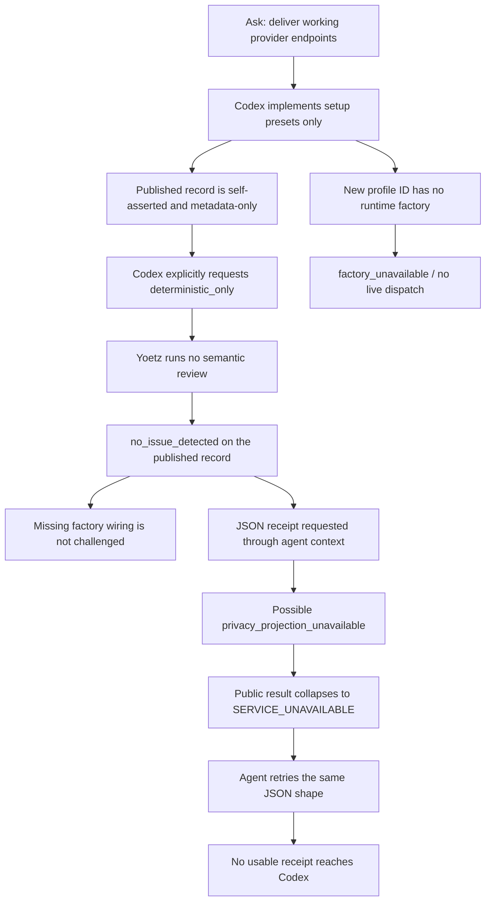

# Codex-testing + Yoetz provider-endpoints dogfood r2 (2026-07-24, post-PR #17)

**Date:** 2026-07-24  
**Codex model / effort:** `gpt-5.6-luna` @ `high`  
**Codex session ID:** `019f9427-ffb9-7e80-a803-f35deb628d4e`  
**Repository baseline packaged:** `586c486` (`main`, merge of PR #17)  
**Experiment branch (local only):** `codex/provider-endpoints-20260724-luna-high-r2` @ `fbca21c`  
**Related intake:** GitHub [issue #15](https://github.com/TheGaySupreme123/yoetz/issues/15) (reused; no new issue)  
**Prior reports:**
[`2026-07-24-codex-testing-provider-endpoints.md`](2026-07-24-codex-testing-provider-endpoints.md)
(first same-day dogfood on `23e188f`),
[`2026-07-22-codex-testing-yoetz-activation.md`](2026-07-22-codex-testing-yoetz-activation.md),
[`2026-07-22-codex-testing-yoetz-second-dogfood-analysis.md`](2026-07-22-codex-testing-yoetz-second-dogfood-analysis.md)

## Purpose and limits

This document preserves evidence from the **second** 2026-07-24 multi-agent
dogfood (Codex interact + independent review + Yoetz health) after PR #17 fixed
`yoetz.check` `INTERNAL_ERROR`. The experiment implementation stays on a
**local** branch and is **not** merged into `main`. Setup presets are not
claimed as live multi-provider semantic dispatch.

## Executive finding

**Yoetz cooperative verification improved; the product gap on “working
endpoints” did not.**

1. Fresh wheel from `586c486` installed cleanly (digest and SHA differ from the
   first dogfood).
2. Codex used Yoetz actively (`start` / `status` / `publish_work` / `check` /
   `receipt`).
3. **`check` succeeded 3/3** with deterministic verdict `no_issue_detected`
   (0× `INTERNAL_ERROR`) — the PR #17 regression is fixed in a live Codex MCP
   session. However, Codex explicitly requested `mode=deterministic_only` all
   three times, so no semantic review was attempted for a task whose central
   question required interpreting whether the implementation actually delivered
   working endpoints.
4. **`receipt` failed 5/5** with retryable `SERVICE_UNAVAILABLE` — still no
   usable completion receipt returned to Codex. Every attempt requested JSON
   through the agent-context projection; that path can fail closed as
   `privacy_projection_unavailable`, which the client deliberately collapses to
   `SERVICE_UNAVAILABLE`. The run did not capture enough internal correlation
   evidence to prove that exact cause, but it is a stronger lead than a generic
   service-readiness race, and Codex did not try the markdown/text fallback.
5. Codex re-shipped the same **setup/binding** slice as `9c7ad2b` (Anthropic,
   Gemini, OpenRouter, Vercel AI Gateway). Independent review: **request
   changes** (no factory wiring; metadata-only tests). Core
   `src/yoetz/config/write.py` (+ CLI setup/binding) match the prior experiment.

**Yoetz → Codex influence (one line):** Yes, for process grounding — successful
`check` verdicts and accepted publications shaped Codex’s workflow and final
honesty — but Yoetz did **not** steer the implementation toward live
multi-provider dispatch, and missing receipts left completion ungated.

---

## 1. How to get all raw local data

### Handoff (Agent 1)

```bash
less $HOME/yoetz-core/.codex-test-handoff.md
less /tmp/codex-provider-endpoints-20260724-r2/meta.txt
```

`.codex-test-handoff.md` is gitignored — path only; do not commit it on `main`.

### Codex-testing session / rollout JSONL

| Artifact | Absolute path |
| --- | --- |
| Full rollout session | `$HOME/.codex-testing/sessions/2026/07/24/rollout-2026-07-24T15-44-37-019f9427-ffb9-7e80-a803-f35deb628d4e.jsonl` |
| Exec JSONL (`--json`) | `/tmp/codex-provider-endpoints-20260724-r2/exec-20260724T124432Z.jsonl` |
| Exec stderr | `/tmp/codex-provider-endpoints-20260724-r2/exec-20260724T124432Z.stderr` |
| Last message | `/tmp/codex-provider-endpoints-20260724-r2/last-message-20260724T124432Z.txt` |
| Prompt | `/tmp/codex-provider-endpoints-20260724-r2/prompt.txt` |
| Launch meta | `/tmp/codex-provider-endpoints-20260724-r2/meta.txt` |
| Codex home / config | `$HOME/.codex-testing/` · `config.toml` |

```bash
less $HOME/.codex-testing/sessions/2026/07/24/rollout-2026-07-24T15-44-37-019f9427-ffb9-7e80-a803-f35deb628d4e.jsonl
less /tmp/codex-provider-endpoints-20260724-r2/exec-20260724T124432Z.jsonl
cat /tmp/codex-provider-endpoints-20260724-r2/last-message-20260724T124432Z.txt
cat $HOME/.codex-testing/config.toml
CODEX_HOME=$HOME/.codex-testing $HOME/.local/bin/codex-testing mcp list
rg -n '"tool": "check"|no_issue_detected|INTERNAL_ERROR|SERVICE_UNAVAILABLE' \
  /tmp/codex-provider-endpoints-20260724-r2/exec-20260724T124432Z.jsonl
```

### Agent 3 Yoetz health notes

```bash
less /tmp/codex-provider-endpoints-20260724-r2/agent3-yoetz-health.md
less /tmp/codex-provider-endpoints-20260724-r2/agent3-mcp-final-summary.json
less /tmp/codex-provider-endpoints-20260724-r2/agent3-mcp-detailed.txt
less /tmp/codex-provider-endpoints-20260724-r2/agent3-cli-final.txt
less /tmp/codex-provider-endpoints-20260724-r2/agent3-pytest-check-slice.txt
less /tmp/codex-provider-endpoints-20260724-r2/agent3-pytest-experiment.txt
less /tmp/codex-provider-endpoints-20260724-r2/agent3-provider-coherence-post.txt
```

### Agent transcripts / subagent logs

Parent conversation:
`$HOME/.cursor/projects/<workspace>/agent-transcripts/fdf8e5b1-da3d-49e4-bb1f-d252159ca1d4/`

| Role | Subagent transcript |
| --- | --- |
| Agent 1 (Codex setup/interact) | `.../subagents/e76aaecf-d0a9-4c72-9cff-f936851d6901.jsonl` |
| Agent 2 (code/conversation review) | `.../subagents/b7a93fd9-def4-4ee5-af33-9aab3245f117.jsonl` |
| Agent 3 (Yoetz health) | `.../subagents/79db036e-c9b2-4c7a-99ac-8df10f1e7130.jsonl` |

```bash
ls -lt $HOME/.cursor/projects/<workspace>/agent-transcripts/fdf8e5b1-da3d-49e4-bb1f-d252159ca1d4/subagents/
```

### Git experiment branch (inspect without merging)

```bash
cd $HOME/yoetz-core
git log --oneline main..codex/provider-endpoints-20260724-luna-high-r2
git show --stat fbca21c
git diff main...codex/provider-endpoints-20260724-luna-high-r2 --stat
git diff main...codex/provider-endpoints-20260724-luna-high-r2
# optional: compare to first same-day experiment
git diff 9c7ad2b..fbca21c --stat -- src/yoetz/config/write.py src/yoetz/cli/
```

- **Branch:** `codex/provider-endpoints-20260724-luna-high-r2`
- **Preserve commit:** `fbca21c` (*experiment: preserve Codex provider-endpoint setup presets (r2 post-PR#17)*)
- **Base:** `main` @ `586c486`
- **Do not merge** into `main` as part of this dogfood wrap-up.
- Earlier same-day snapshot (pre-PR#17 baseline): `codex/provider-endpoints-20260724-luna-high` @ `9c7ad2b`

### Installed Yoetz path / version / wheel SHA

| Item | Value |
| --- | --- |
| CLI | `$HOME/.local/bin/yoetz` → uv tool env |
| Version | `0.1.0` |
| Wheel | `$HOME/yoetz-core/dist/yoetz-0.1.0-py3-none-any.whl` |
| Wheel SHA-256 | `c383733438496fa07bd817ee7e374a6fd011048b0b7955618f607600d2c64be5` |
| Install | `uv tool install … "yoetz[semantic-openai] @ ./dist/yoetz-0.1.0-py3-none-any.whl"` |
| Python | `3.14.6` (managed) |
| Resource manifest digest | `sha256:5ed7963eb8e73cb76d73bd36b3280f8b5446fcf35d7fa994814d75a898bcc3c0` |
| Packaged from | `586c486` |
| Prior dogfood wheel SHA | `6fd26f83078816e7deb6f4f3ab15c3e54c01b5414005fe875d20c608ac630008` |
| Prior dogfood digest | `sha256:e2bf11b70304555433dfbbaa97d01bdb2e2c1362879de22a9aa64c6f3f81b6f9` |

```bash
yoetz --version
yoetz version --json
shasum -a 256 $HOME/yoetz-core/dist/yoetz-0.1.0-py3-none-any.whl
yoetz service status --json
yoetz integrate codex mcp status --codex-path $HOME/.local/bin/codex-testing
```

**Important:** the installed tool lags the experiment branch. New `--provider`
presets exist only in source on `codex/provider-endpoints-20260724-luna-high-r2`
(or via `uv run` against that tree), not in the system `yoetz` wheel used during
the Codex session.

---

## 2. Findings (synthesis across agents)

### Agent 1 — Codex interact (partial success)

- Packaged/installed Yoetz `0.1.0` from a fresh PR #17 wheel; configured
  `codex-testing` for `gpt-5.6-luna` @ high; ran the provider-endpoints ask.
- Codex reused **issue #15**, implemented 24-file setup/preset work (+546/−147),
  claimed 42 focused tests + Ruff + Pyright, **did not commit/PR** (design gate).
- Yoetz MCP: publications accepted after recoverable invalids; **`check` →
  `no_issue_detected` ×3**; **`receipt` → `SERVICE_UNAVAILABLE` ×5**.

### Agent 2 — Review (verdict: **request changes**)

- Ask wanted working endpoints; delivery is setup/binding only (honest caveat).
- New profile IDs ignored by `external_factory_builders_from_config` (only
  official OpenAI / Fireworks / owner-declared Responses builders).
- Core implementation matches prior `9c7ad2b` for setup/binding center;
  host/path live in Python `ProviderPreset`, not durable TOML `https_origin`.
- Tests assert preset metadata/URLs, not factory selection or live dispatch.
- Process/honesty good; `check` improved vs prior try; dispatch gap unchanged.

### Agent 3 — Yoetz health (verdict: **partial**)

- Service `ready`; Codex-testing MCP `yoetz_owned`; cooperative ledger path
  works.
- **`check` INTERNAL_ERROR is fixed** in live Codex MCP (3/3 ok).
- **`receipt` still broken** (5/5 `SERVICE_UNAVAILABLE`, retryable).
- New presets source-only vs installed wheel; no runtime factory wiring for
  Anthropic/Gemini/OpenRouter/Vercel profiles.

### Cross-run comparison

| Layer | Try 1 (2026-07-22) | Try 2 (2026-07-22) | First 2026-07-24 (`23e188f`) | This r2 (`586c486`) |
| --- | --- | --- | --- | --- |
| Activation / `start` | poor / unused | prompt-forced | works after recovery | works after recovery |
| `publish_work` | unused | failed | accepted → frontier 10 | accepted (frontier through check @ 13) |
| `status` | unused | invalid | works after recovery | works after recovery |
| `check` / verdict | absent | failed | **`INTERNAL_ERROR`** | **`no_issue_detected` ×3** |
| `receipt` | absent | absent | blocked by check | **`SERVICE_UNAVAILABLE` ×5** |
| Implementation honesty | weaker | improved | best explicit non-claim | same / slightly cleaner |
| Live multi-provider dispatch | no | no | no (setup only) | **no** (same setup only) |

### What specifically did not work in Yoetz

The primary product finding is not merely that Luna stopped too early. Yoetz
also failed to make the missing work hard to miss:

1. **Semantic review was not selected.** All three `check` requests explicitly
   used `mode=deterministic_only`; every result therefore reported
   `semantic_status=not_requested` and `semantic_reason=deterministic_mode`.
   This was the wrong verification mode for an implementation task whose
   acceptance depended on interpreting code composition, request shape,
   response normalization, and evidence of actual interoperability.
2. **The always-delivered guidance does not teach mode selection.** It says to
   publish and call `check`, but does not tell an agent when to choose
   `deterministic_only`, `semantic_if_configured`, or `semantic_required`.
   The application verification default is `semantic=optional` (derived mode
   `semantic_if_configured`), but the MCP request requires an explicit mode.
   Without a decision rule, Codex overrode the useful default by choosing the
   weakest mode.
3. **The clean-looking verdict obscured the material limitation.** The checks
   returned `no_issue_detected` with coverage limited to `published_only`,
   `metadata_only`, `self_asserted`, and deterministic checks. That verdict is
   contractually only “no unresolved deterministic completion-integrity issue
   was found in the published record,” but it was easy to read as endorsement
   of the endpoint implementation. The result had no semantic-gap code because
   semantic review was never requested.
4. **Yoetz did not require endpoint capability evidence.** No factory-selection
   test, credential-bound request capture, normalized response evidence, or live
   provider smoke was published as an acceptance requirement. Deterministic
   checks therefore had no rule-shaped contradiction to detect when Codex
   delivered preset metadata instead of runnable dispatch.
5. **Even a semantic request would need better case material.** Yoetz does not
   observe the repository by itself. A useful semantic case would have required
   bounded changed hunks or symbols plus the factory-selection and runtime-smoke
   evidence. Merely changing the mode without publishing that material could
   still leave the reviewer blind.
6. **Receipt delivery was unusable and the public error was too coarse.** Five
   JSON receipt attempts returned only `SERVICE_UNAVAILABLE`. The control path
   maps `privacy_projection_unavailable` to that public code, so the agent
   cannot distinguish “retry after service recovery” from “this receipt format
   cannot be projected to agent context.” The agent retried the same request
   shape and never learned to switch to markdown/text. This is a known path:
   [PR #4](https://github.com/TheGaySupreme123/yoetz/pull/4) and the current
   receipt conformance test document JSON projection failing closed under an
   agent-context policy that blocks document leaves.
7. **The natural MCP contract remained brittle.** Codex first produced
   malformed `start`, `status`, and `publish_work` requests and later hit a
   frontier conflict. Recovery worked, but the ceremony consumed retries and
   model attention that should have gone toward evaluating the implementation.
8. **The actual provider runtime was still incomplete.** New preset IDs were
   not registered by `external_factory_builders_from_config`, so the privacy
   gateway would reach `factory_unavailable`. This is a Yoetz endpoint/product
   gap independent of whether Codex chose the correct implementation.



### What needs to change

| Priority | Yoetz change | Required outcome/evidence |
| --- | --- | --- |
| P0 | Add an explicit semantic-mode decision rule to tier-0 and workflow guidance, tool descriptions, and the Codex skill. | Most material implementation/review tasks use `semantic_if_configured`; use `semantic_required` when a completion claim depends on qualitative correctness, design conformance, security/privacy reasoning, interoperability, or whether code actually satisfies the ask. Reserve `deterministic_only` for explicitly local/structural checks, semantic-disabled policy, or a deliberate no-egress choice, and require the agent to disclose that limitation. |
| P0 | Make semantic absence prominent in check summaries and completion guidance. | A deterministic-only `no_issue_detected` summary leads with “semantic review not requested” and cannot be presented as a clean implementation review. Consider a typed limitation/gap for material completion claims checked without semantic review; this is a behavior/spec change, not a postmortem-only wording tweak. |
| P0 | Repair/clarify MCP receipt projection. | JSON either projects safely, or returns a specific actionable bounded error; guidance tells an agent when to request markdown/text. Add a live MCP regression proving `check → receipt` returns a durable usable receipt under the default agent-context policy. |
| P0 | Implement real provider factory composition. | Each supported profile selects a production adapter/factory with exact host/path/API style, credential-bound final request bytes, response normalization, and fail-closed privacy receipts. |
| P0 | Require capability and runtime evidence before claiming “working endpoint.” | Per-provider factory-selection tests plus credential-safe request-shape tests and an explicitly authorized live smoke/receipt. Preset/URL metadata tests alone cannot satisfy the claim. |
| P1 | Improve semantic-case publication guidance. | For code/review tasks, publish the smallest state-bound diff/symbol and directly relevant test or failure excerpt needed by semantic review; never rely only on self-asserted completion prose. |
| P1 | Improve check-mode ergonomics. | The MCP descriptor exposes the decision table; preferably allow an omitted mode to resolve through the configured `VerificationPolicy` default, subject to the owning protocol/spec decision. |
| P1 | Improve natural-call recovery. | Examples/defaults make valid actor/client/frontier/mode payloads easy to produce, while stale-frontier errors point directly to `status` plus idempotent retry. |

For this particular endpoint task, the correct verification request was
`semantic_required`, not `deterministic_only`: without a successful semantic
review, Yoetz should have returned `incomplete_check` rather than a
complete-looking deterministic verdict. That still would not prove the
providers were live; semantic review and the authorized runtime capability
evidence are both required.

The provider work remains covered by issue #15. The receipt-projection behavior
and semantic-selection/default change should receive their own duplicate search
and design-gated issues before implementation because they affect protocol,
privacy/egress, and completion behavior.

### MCP call counts (exec JSONL)

From `/tmp/codex-provider-endpoints-20260724-r2/exec-20260724T124432Z.jsonl`:

| Tool | Completed | Outcomes |
| --- | ---: | --- |
| `yoetz.start` | 3 | 1× `INVALID_REQUEST`, 2× ok (`created`) |
| `yoetz.status` | 4 | 1× `INVALID_REQUEST`, 3× ok |
| `yoetz.publish_work` | 5 | 3× ok; 1× `EVENT_INVALID`; 1× `FRONTIER_CONFLICT` |
| `yoetz.check` | 3 | **3× `ok=true`, verdict `no_issue_detected`** |
| `yoetz.receipt` | 5 | **5× `SERVICE_UNAVAILABLE`** (e.g. `err_c77b4c65-…`, `err_33da4afd-…`) |

Task `tsk_b984851d-de42-4b66-a761-7113a872ea8c`; writer `wri_3c302098-bd76-480b-938e-9a365e4a204e`.

---

## 3. Yoetz influence on Codex

### Did Yoetz actually change anything?

**Yes — process and completion ceremony. No — implementation content toward
working endpoints.**

Evidence Yoetz **did** shape process:

- Codex called Yoetz throughout (20 completed Yoetz MCP tool calls in the exec
  JSONL) and recovered from early malformed `start` / `status` /
  `publish_work` payloads.
- Successful **`check` → `no_issue_detected`** gave Codex a real deterministic
  verdict (unlike the first 2026-07-24 dogfood). The final message reports that
  outcome rather than inventing a clean receipt.
- Failed **`receipt`** attempts are also reflected honestly (`SERVICE_UNAVAILABLE`;
  no live receipt claimed).

Evidence Yoetz **did not** reshape the code product:

- Review found the setup/binding center **byte-equivalent** to the prior
  experiment (`9c7ad2b`); no factory/adapters/capability evidence for the new
  providers.
- Codex selected `deterministic_only` for every check. Yoetz's guidance did not
  direct it to `semantic_required`, so successful checks with **0 findings** did
  not force deeper work. A clean deterministic check on setup-only publications
  is not semantic review of live egress.
- No usable receipt returned to Codex to constrain its completion wording
  (Codex correctly stopped at the design gate on issue #15 regardless). Because
  projection happens after application execution, the public failure alone does
  not prove whether the internal receipt append committed.

### Better or worse?

| Aspect | Direction | Notes |
| --- | --- | --- |
| Activation + ledger publication | **Same / still good** | Cooperative path remains usable |
| `check` / verdict | **Better** | PR #17 fixed `INTERNAL_ERROR`; live closed checks |
| Semantic selection/guidance | **Broken / exposed** | All checks were `deterministic_only`; guidance gives no rule for choosing semantic modes |
| `receipt` | **Still broken** | JSON agent-context projection returned only generic `SERVICE_UNAVAILABLE`; no actionable fallback |
| Process honesty | **Better / sustained** | Codex reports check success and receipt failure accurately |
| Code quality vs ask (“working endpoints”) | **Unchanged incomplete** | Setup presets only; not live dispatch |
| Risk of false confidence | **Mixed** | Clean `check` can look like endorsement of the slice; without factory wiring + receipt it is only a deterministic ledger ceremony |

Compared to the first 2026-07-24 dogfood: Yoetz is **materially better at
gating/verifying cooperative work** (`check` works). It is still **not** a
semantic multi-provider reviewer, and it still **cannot close with a receipt**.

---

## 4. How Yoetz worked in this run

### Packaging / install

```bash
cd $HOME/yoetz-core
rm -rf dist && uv build --no-sources
uv tool install --managed-python --python 3.14.6 --force --reinstall \
  "yoetz[semantic-openai] @ ./dist/yoetz-0.1.0-py3-none-any.whl"
```

Succeeded. Freshness confirmed by new wheel SHA and resource digest vs the
prior dogfood. Package semver remains `0.1.0`.

### Service / MCP ownership

- `yoetz service status` → `ready` (after brief post-reinstall unavailability;
  generation noted in Agent 3 probes).
- `yoetz integrate codex mcp status --codex-path …/codex-testing` →
  `yoetz_owned`.
- Codex config `[mcp_servers.yoetz]` → `yoetz mcp serve`.
- Isolated `CODEX_HOME=$HOME/.codex-testing`; no credentials copied from
  normal `~/.codex`.

### Succeeded

- Install + CLI identity + OpenAI adapter presence on the PR #17 wheel.
- Service readiness and Codex-testing MCP registration.
- Live MCP: `start` / recovered `status` / accepted `publish_work`.
- Live MCP: **`check` closed** with `no_issue_detected` ×3 (policy packs
  `research-evidence/0.1.0`, `work-integrity/0.1.0`).
- Focused tests: Agent 3 recorded 14 passed on check/MCP slice and 42 on the
  dirty experiment setup slice.

### Failed / incomplete

- **`receipt` → `SERVICE_UNAVAILABLE`** every attempt; no usable receipt was
  returned. The public result does not prove whether the internal receipt append
  committed before projection failed.
- Every receipt request repeated `format=json`,
  `redaction_profile=default_local_export`; no markdown/text fallback was tried.
  The public code may represent `privacy_projection_unavailable`, not only
  service downtime, because the control client deliberately maps both to
  `SERVICE_UNAVAILABLE`.
- Early malformed agent payloads (`INVALID_REQUEST` / `EVENT_INVALID` /
  `FRONTIER_CONFLICT`) before recovery — contract still brittle under natural
  agent-authored calls.
- Every check explicitly selected `deterministic_only`; no semantic evaluator
  was requested despite this being a material implementation/review task.
- Experiment presets **not** in installed wheel; **not** wired to runtime
  Responses/chat factories.
- Observation/hooks consent not required for this explicit MCP task and was not
  the steering path.

### Experiment code disposition

Preserved locally on `codex/provider-endpoints-20260724-luna-high-r2` @
`fbca21c`. Not merged to `main`. Suitable as review evidence for setup/binding
UX + post-PR#17 check behavior; **not** release-ready multi-provider egress
without factory + capability evidence + semantic-review guidance/default repair
and receipt path repair + reinstall.

---

## Evidence authority order used

Conclusions prefer: ADRs / specs for intended product boundaries; Agent 3
CLI/MCP probes for runtime health; exec/rollout JSONL for what Codex actually
called; Agent 2 review for code honesty vs ask; Agent 1 handoff for
packaging/session metadata. No conclusion relies only on Codex’s final answer
where logs or independent probes contradict it.
