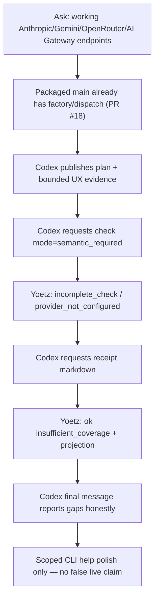

# Codex-testing + Yoetz provider-endpoints dogfood r4 (2026-07-25, post-PR #18)

**Date:** 2026-07-25  
**Codex model / effort:** `gpt-5.6-luna` @ `high`  
**Codex session / thread ID:** `019f98c7-a63c-7d51-a890-7fc698f1ed9d`  
**Repository baseline packaged:** `abbfd247` (`main`, merge of PR #18
`fix/r2-dogfood-product-gaps`)  
**Experiment branch (local preserve; do not merge for this wrap-up):**
`codex/provider-endpoints-20260725-luna-high-r4` @ `38eda37`  
**Related intake:** GitHub [issue #15](https://github.com/TheGaySupreme123/yoetz/issues/15)
(reused; progress comment; no PR — design gate still open)  
**Prior reports:**
[`2026-07-24-codex-testing-provider-endpoints.md`](2026-07-24-codex-testing-provider-endpoints.md)
(r1),
[`2026-07-24-codex-testing-provider-endpoints-r2.md`](2026-07-24-codex-testing-provider-endpoints-r2.md)
(r2),
[`2026-07-22-codex-testing-yoetz-activation.md`](2026-07-22-codex-testing-yoetz-activation.md),
[`2026-07-22-codex-testing-yoetz-second-dogfood-analysis.md`](2026-07-22-codex-testing-yoetz-second-dogfood-analysis.md)

**Aborted prior attempt (r3):** same product ask on `gpt-5.6-luna` @ `light` from
`fix/r2-dogfood-product-gaps` @ `2c049e0` failed immediately on
`usage_limit_exceeded` (no MCP, no code). Artifacts remain under
`/tmp/codex-provider-endpoints-20260724-luna-light-r3/` for quota evidence only.

## Purpose and limits

This document preserves evidence from the **2026-07-25** multi-agent dogfood
(Codex interact + independent review + Yoetz health) after PR #18 landed the
r2 postmortem product-gap fixes (receipt projection, semantic-mode selection,
provider factory/presets) on `main`. The small Codex UX delta stays on a
**separate local branch** and is **not** merged into `main` as part of this
wrap-up.

Limits: live semantic review still could not run in the Codex-testing
environment (`provider_not_configured`). “Working endpoints” here means
factory/dispatch wiring already on packaged `main`, plus clearer setup/help —
not a live multi-provider smoke with real API keys.

**Follow-up analysis (same day, post-wrap-up).** Sections
[2.5](#25-root-cause-why-semantic-review-did-not-run),
[2.6](#26-newly-confirmed-defect-committed-write-reported-as-internal_error-p0),
[2.7](#27-corrections-to-in-run-agent-findings) and
[5](#5-what-needs-to-improve) were added after direct inspection of the
persisted r4 ledger and catalog, which none of the three in-run agents opened.
They establish the exact root cause of the semantic gap and confirm one
**P0 correctness defect** that the live agents mis-classified as transient
friction. Where they contradict an in-run agent conclusion, the ledger wins and
the correction is stated explicitly.

## Executive finding

**Yoetz cooperative path healed relative to r2; the product ask is largely
already satisfied on packaged `main`; Codex’s r4 delta is small UX polish.**

1. Fresh wheel from `abbfd247` installed cleanly (digest matches r3 packaging
   tip; differs from r2).
2. Codex used Yoetz end-to-end (`start` / `status` / `publish_work` / `check` /
   `receipt`) and finished exit `0` in ~8.5 minutes.
3. **`check`:** one recovered `FRONTIER_CONFLICT`, then **ok** with verdict
   `incomplete_check`. Both check requests used **`mode=semantic_required`**
   (unlike r2’s all-`deterministic_only`). Semantic status:
   `not_configured` / `provider_not_configured` — honest gap, not a silent
   clean pass.
4. **`receipt`:** **1/1 ok** with conclusion `insufficient_coverage`,
   `format=markdown`, and agent-context privacy projection populated —
   **no** r2-style `SERVICE_UNAVAILABLE`.
5. Independent review (**approve**): PR #18 already wires Anthropic/Gemini/
   OpenRouter → Chat Completions factory and OpenAI/Fireworks/Vercel →
   Responses factory. Codex correctly avoided re-shipping r1/r2 presets-only
   work and only clarified CLI help/prompts (+39/−12 across 6 files).
6. **The semantic gap was a test-environment gap, not a Yoetz bug — but it was
   two blockers, not one.** The installation had a bound provider endpoint and
   `verification.semantic = "optional"`, yet **no connected provider credential**
   *and* an effective privacy policy of `local_only` with `llm_inference`
   disabled. Either alone is sufficient to force `provider_not_configured`.
   Ledger `semantic_jobs` / `semantic_attempts` are both **0**: nothing was ever
   dispatched. See [2.5](#25-root-cause-why-semantic-review-did-not-run).
7. **One P0 correctness defect is newly confirmed.** The `publish_work` that
   returned `INTERNAL_ERROR` (`retryable: no`) **actually committed**: operation
   `req_af8a…0a18` is `state=complete` / `phase=terminal` and its
   `claim_recorded` event is durable at `ingestion_seq 5`, with a stored success
   result. Yoetz told the agent its completion claim failed while durably
   recording it. This caused the downstream `FRONTIER_CONFLICT` and the extra
   `status` round-trip. See
   [2.6](#26-newly-confirmed-defect-committed-write-reported-as-internal_error-p0).

**Yoetz → Codex influence (one line):** Yes, and **for the better** — Yoetz
drove semantic-mode selection, returned a usable receipt that constrained
completion honesty, and steered Codex away from over-claiming while allowing a
scoped UX fix on top of an already-wired main.

**What this run did *not* establish:** that any provider endpoint works live.
No semantic job, no outbound request, no provider response — for any of the six
presets. The r2 P0 “require capability and runtime evidence before claiming
‘working endpoint’” is **still unmet**, and r4 does not move it. Every
run so far (r1–r4) has proven wiring and stopped short of a live smoke.

---

## 1. How to get all raw local data

### Handoff (Agent 1)

```bash
less $HOME/yoetz-core/.codex-test-handoff.md
less /tmp/codex-provider-endpoints-20260725-luna-high-r4/meta.txt
less /tmp/codex-provider-endpoints-20260725-luna-high-r4/codex-test-handoff.md
```

`.codex-test-handoff.md` is gitignored — path only; do not commit it on `main`.

### Codex-testing session / rollout JSONL

| Artifact | Absolute path |
| --- | --- |
| Full rollout session | `$HOME/.codex-testing/sessions/2026/07/25/rollout-2026-07-25T13-17-28-019f98c7-a63c-7d51-a890-7fc698f1ed9d.jsonl` |
| Exec JSONL (`--json`) | `/tmp/codex-provider-endpoints-20260725-luna-high-r4/exec-20260725T101722Z.jsonl` |
| Exec stderr | `/tmp/codex-provider-endpoints-20260725-luna-high-r4/exec-20260725T101722Z.stderr` |
| Last message | `/tmp/codex-provider-endpoints-20260725-luna-high-r4/last-message-20260725T101722Z.txt` |
| Prompt | `/tmp/codex-provider-endpoints-20260725-luna-high-r4/prompt.txt` |
| Launch meta | `/tmp/codex-provider-endpoints-20260725-luna-high-r4/meta.txt` |
| Exit code | `/tmp/codex-provider-endpoints-20260725-luna-high-r4/meta-exit.txt` (`0`) |
| Codex home / config | `$HOME/.codex-testing/` · `config.toml` |

```bash
less $HOME/.codex-testing/sessions/2026/07/25/rollout-2026-07-25T13-17-28-019f98c7-a63c-7d51-a890-7fc698f1ed9d.jsonl
less /tmp/codex-provider-endpoints-20260725-luna-high-r4/exec-20260725T101722Z.jsonl
cat /tmp/codex-provider-endpoints-20260725-luna-high-r4/last-message-20260725T101722Z.txt
cat $HOME/.codex-testing/config.toml
CODEX_HOME=$HOME/.codex-testing $HOME/.local/bin/codex-testing mcp list
rg -n '"tool": "check"|semantic_required|incomplete_check|insufficient_coverage|SERVICE_UNAVAILABLE|FRONTIER_CONFLICT' \
  /tmp/codex-provider-endpoints-20260725-luna-high-r4/exec-20260725T101722Z.jsonl
# confirm model/effort from turn_context
rg -n 'turn_context|gpt-5.6-luna|"effort"|reasoning_effort' \
  $HOME/.codex-testing/sessions/2026/07/25/rollout-2026-07-25T13-17-28-019f98c7-a63c-7d51-a890-7fc698f1ed9d.jsonl \
  | head -40
```

### Persisted ledger / catalog (basis for sections 2.5–2.7)

The r4 task ledger and the installation catalog are still on disk. **Copy before
querying** — never open the live database from an analysis shell.

```bash
YZ="$HOME/Library/Application Support/yoetz"
TSK=tsk_ecb96379-14ae-4119-a9ad-2b0b4366d0cd
cp "$YZ/tasks/$TSK/ledger.sqlite3" /tmp/r4-ledger.sqlite3
cp "$YZ/catalog.sqlite3" /tmp/r4-catalog.sqlite3

# what is actually durable in the ledger (7 events, seq 1..7)
sqlite3 -header -column /tmp/r4-ledger.sqlite3 \
  "select ingestion_seq, schema_name, accepted_at, operation_id
     from events order by ingestion_seq;"

# operation states — note req_af8a… is complete/terminal despite INTERNAL_ERROR
sqlite3 -header -column /tmp/r4-ledger.sqlite3 \
  "select operation_id, operation_kind, state, phase,
          first_ingestion_seq, last_ingestion_seq, quarantine_code
     from operations order by created_at;"

# the stored success result for the call the agent was told had failed
sqlite3 /tmp/r4-ledger.sqlite3 \
  "select cast(result_canonical as text) from operations
     where operation_id like 'req_af8a%';"

# proof no semantic dispatch was ever attempted (both 0)
sqlite3 /tmp/r4-ledger.sqlite3 "select count(*) from semantic_jobs;"
sqlite3 /tmp/r4-ledger.sqlite3 "select count(*) from semantic_attempts;"

# effective privacy policy: profile=local_only, llm_inference enabled=false
sqlite3 /tmp/r4-catalog.sqlite3 \
  "select policy_version, state, policy_canonical from privacy_policy_versions
     where state = 'current';"

# bound endpoint exists, credential does not
cat "$YZ/config.toml"
```

### Agent 3 Yoetz health notes

```bash
less /tmp/codex-provider-endpoints-20260725-luna-high-r4/agent3-yoetz-health.md
less /tmp/codex-provider-endpoints-20260725-luna-high-r4/agent3-mcp-final-summary.json
less /tmp/codex-provider-endpoints-20260725-luna-high-r4/agent3-baseline.txt
less /tmp/codex-provider-endpoints-20260725-luna-high-r4/agent3-mcp-live-snapshot.json
less /tmp/codex-provider-endpoints-20260725-luna-high-r4/agent3-pytest-receipt-slice.txt
```

### Agent transcripts / subagent logs

Parent conversation:
`$HOME/.cursor/projects/Users-shayb-yoetz-core/agent-transcripts/80553304-25f3-4c69-b6ac-9d7e6663692e/`

| Role | Subagent transcript |
| --- | --- |
| Agent 1 (Codex setup/interact) | `.../subagents/e18b6544-48f5-4767-9a1f-9f2febde7e1d.jsonl` |
| Agent 2 (code/conversation review) | `.../subagents/7763facd-454a-4025-9879-b7d0c7056d04.jsonl` |
| Agent 3 (Yoetz health) | `.../subagents/050af7eb-8dbf-4d20-b0c9-a0a0defcda3c.jsonl` |

```bash
ls -lt $HOME/.cursor/projects/Users-shayb-yoetz-core/agent-transcripts/80553304-25f3-4c69-b6ac-9d7e6663692e/subagents/
```

### Git experiment branch (inspect without merging)

```bash
cd $HOME/yoetz-core
git log --oneline main..codex/provider-endpoints-20260725-luna-high-r4
git show --stat 38eda37
git diff main...codex/provider-endpoints-20260725-luna-high-r4 --stat
git diff main...codex/provider-endpoints-20260725-luna-high-r4
```

- **Branch:** `codex/provider-endpoints-20260725-luna-high-r4`
- **Preserve commit:** `38eda37` (*feat: enhance CLI help documentation with reviewed provider presets and wire styles*)
- **Base:** `main` @ `abbfd247`
- **Do not merge** into `main` as part of this dogfood wrap-up (report-only on main).
- Prior local experiment snapshots: `…-luna-high` @ `9c7ad2b`, `…-luna-high-r2` @ `fbca21c`,
  `…-luna-light-r3` (clean / no code after quota fail).

### Installed Yoetz path / version / wheel SHA

| Item | Value |
| --- | --- |
| CLI | `$HOME/.local/bin/yoetz` → uv tool env |
| Version | `0.1.0` |
| Wheel | `$HOME/yoetz-core/dist/yoetz-0.1.0-py3-none-any.whl` |
| Wheel SHA-256 | `5554cffc3ce13acf6972e6154c57dce9aa976bafa2f03c883bac08c28ec96ad2` |
| Install | `uv tool install … "yoetz[semantic-openai] @ ./dist/yoetz-0.1.0-py3-none-any.whl"` |
| Python | `3.14.6` (managed) |
| Resource manifest digest | `sha256:afd57bccb3c76801419ce9a543ef19e51a219a42c0925cca1d4dcbc990a92708` |
| Packaged from | `abbfd247` (`main` / PR #18) |
| vs r2 digest | **CHANGED** (`sha256:5ed7963…bcc3c0`) |
| vs r3 digest | **SAME** (PR #18 merged the r3 packaging tip) |

```bash
yoetz --version
yoetz version --json
shasum -a 256 $HOME/yoetz-core/dist/yoetz-0.1.0-py3-none-any.whl
yoetz service status --json
yoetz integrate codex mcp status --codex-path $HOME/.local/bin/codex-testing
CODEX_HOME=$HOME/.codex-testing $HOME/.local/bin/codex-testing mcp list
```

**Important:** the installed wheel is the packaged `main` tip used during the
Codex session. The experiment branch’s +39/−12 CLI help delta is **not** in that
wheel unless reinstalled from `38eda37`. Factory/dispatch for the asked
providers lives on packaged `main` (PR #18), not only on the experiment branch.

---

## 2. Findings (synthesis across agents)

### Agent 1 — Codex interact (success)

- Packaged/installed Yoetz `0.1.0` from `main` @ `abbfd247`; configured
  `codex-testing` for `gpt-5.6-luna` @ **high** (restored from r3’s light);
  created `codex/provider-endpoints-20260725-luna-high-r4`; ran the same
  provider-endpoints ask as r1/r2.
- Codex reused **issue #15**, commented progress, implemented a **6-file**
  help/prompt clarity slice (+39/−12), claimed focused tests + Ruff + Pyright,
  **did not open a PR** (design gate), later preserved as commit `38eda37` on
  the experiment branch only.
- Yoetz MCP usable end-to-end: recovered malformed `start`/`publish_work`,
  **`check` → `incomplete_check`**, **`receipt` → `insufficient_coverage`**.

### Agent 2 — Review (verdict: **approve**)

- Product ask for working multi-provider endpoints is **already met on
  packaged main** via PR #18 factory composition (`external_factory_builders_from_config`
  / Chat Completions vs Responses mapping).
- r4 Codex delta is discoverability-only (CLI help, prompts, one subprocess
  help test + owning specs) — not a re-ship of r1/r2 presets-only registries.
- Process/honesty good: no secrets; no over-claim of live interoperability;
  Yoetz semantic gap and receipt conclusion reported accurately.
- Non-blocking nit: `specs/src/yoetz/cli/app.md` slightly overclaims root-help
  wire-style naming; endpoint help + test cover the intended clarity.

### Agent 3 — Yoetz health (verdict: **healthy**, improved vs r2)

- Install/CLI/MCP config healthy on digest `afd57bcc…`.
- Live Codex→Yoetz: receipt projection **fixed**; semantic-mode path
  **exercised**; no material regression of the post-PR#17 check
  `INTERNAL_ERROR` fix.
- Focused receipt wording/projection pytest slice: **11 passed**.

### Cross-run comparison

| Layer | r1 (`23e188f`) | r2 (`586c486`) | r3 (quota) | r4 (`abbfd247`) |
| --- | --- | --- | --- | --- |
| Activation / `start` | works after recovery | works after recovery | not exercised | works after recovery |
| `publish_work` | accepted | accepted | — | accepted (after invalids + 1 `INTERNAL_ERROR`) |
| `check` | **`INTERNAL_ERROR`** | **`no_issue_detected` ×3** (`deterministic_only`) | — | **`incomplete_check`** (`semantic_required`) |
| Semantic mode | n/a / broken check | **never requested** | — | **`semantic_required` ×2** |
| `receipt` | blocked | **`SERVICE_UNAVAILABLE` ×5** | — | **ok `insufficient_coverage` ×1** |
| Implementation vs ask | setup presets only | same setup only | none | **factory on main** + UX polish |
| Review verdict | request changes | request changes | blocked (quota) | **approve** |
| Semantic actually dispatched | no | no | — | **no** (`semantic_jobs = 0`) |
| Live provider proof | none | none | none | **none** |
| Yoetz calls / first-try failures | — | — | — | 13 / 5 (38%), of which **1 was a false failure** |

### What specifically changed in Yoetz (vs r2 postmortem gaps)

PR #18 / packaged `main` addressed the r2 P0 themes in live behavior:

1. **Semantic-mode selection path works.** Codex requested `semantic_required`
   twice. Yoetz answered with structured `semantic_status=not_configured` and
   verdict `incomplete_check` instead of a complete-looking deterministic pass.
2. **Receipt projection works under agent-context.** Markdown receipt returned
   with `ok: true` and populated `privacy_projection` (`sink: agent_context`).
   No generic `SERVICE_UNAVAILABLE` collapse in this session.
3. **Provider factory composition exists on main.** Independent review confirmed
   Anthropic/Gemini/OpenRouter and Vercel AI Gateway mapping through production
   factory builders — the r1/r2 “presets without dispatch” gap is closed on the
   packaged baseline.
4. **Natural MCP ceremony remains brittle but recoverable.** Early
   `INVALID_REQUEST` / one `publish_work` `INTERNAL_ERROR` / one
   `FRONTIER_CONFLICT` still consumed retries; `status` recovery worked.
   *(Revised by §2.6/§2.7: the `INTERNAL_ERROR` was a committed write reported
   as a failure, and it caused the `FRONTIER_CONFLICT`. Genuine caller-shape
   friction is 3 calls, not 5.)*

5. **What PR #18 did not touch.** The r2 P0s on semantic-mode selection and
   receipt projection are closed in observed behavior. The r2 P0 requiring
   runtime evidence before claiming a working endpoint is **untouched**, and
   nothing in PR #18 makes semantic readiness visible before a `check` fails
   (§2.5).



### MCP call counts (exec JSONL)

From `/tmp/codex-provider-endpoints-20260725-luna-high-r4/exec-20260725T101722Z.jsonl`:

| Tool | Calls | Outcomes as seen by Codex |
| --- | ---: | --- |
| `yoetz.start` | 2 | 1× `INVALID_REQUEST` (`/request_id` shape), 1× ok `created` |
| `yoetz.status` | 2 | 2× ok (both were recovery calls) |
| `yoetz.publish_work` | 6 | 3× ok `accepted`; 2× `INVALID_REQUEST`; 1× `INTERNAL_ERROR` |
| `yoetz.check` | 2 | 1× `FRONTIER_CONFLICT`; 1× ok `incomplete_check` (`semantic_required`) |
| `yoetz.receipt` | 1 | **1× ok `insufficient_coverage`** (`rcp_b59d6192-…`) |

**13 Yoetz MCP calls, 5 first-try failures (38%)** — but they are not five of
the same thing:

- **3 caller-shape errors** (`start` `/request_id`; two `publish_work`
  `INVALID_REQUEST`) — genuinely the agent's payloads, though two of the three
  came back with an empty field pointer and no location to fix.
- **1 false failure**: the `publish_work` `INTERNAL_ERROR` that actually
  committed (§2.6).
- **1 consequence**: the `check` `FRONTIER_CONFLICT`, caused by the false
  failure leaving Codex with a stale frontier.

So the honest read is **3 caller errors plus 1 product defect that cost 2 extra
round-trips**, not "5 noisy agent retries".

Task `tsk_ecb96379-14ae-4119-a9ad-2b0b4366d0cd`; session
`ses_0711f641-af8d-4eff-887b-f1dab7993c97`. Ledger head after the run:
`sequence 7`, 7 events, all `projection_status = projected`.

Run cost/shape (`turn.completed`): input 6,334,786 tokens (6,137,856 cached),
output 21,445, reasoning 7,902; 32 shell commands, 26 MCP calls (13 Yoetz,
13 `codex_apps` GitHub), 4 file-change items; ledger span 10:18:37 → 10:25:08Z.

### 2.5 Root cause: why semantic review did not run

Every prior report recorded `provider_not_configured` as a single undifferentiated
"environment gap". It is actually a **four-condition gate, two of which were
unmet**, and the run never reached the point of even trying.

Composition (`src/yoetz/service/ready_composition.py:1481`) computes:

```python
semantic_configured = config.verification.semantic != "disabled"
semantic_ready = semantic_configured and bool(connected_provider_ids)
```

and when `semantic_ready` is false, the evaluator is hard-wired to
`_semantic_not_configured` (`:1562`), which returns
`NOT_CONFIGURED / PROVIDER_NOT_CONFIGURED` **without consulting the provider,
the policy, or the network**. Same result if the binding is present but its
`provider_id` is absent from `connected_provider_ids` (`:1547-1550`).

| # | Condition | r4 state | Verdict |
| --- | --- | --- | --- |
| 1 | `verification.semantic != "disabled"` | `"optional"` in `config.toml` | **met** |
| 2 | Provider endpoint bound in `config.toml` | `openai` / `gpt-5.4` / `openai-responses` | **met** |
| 3 | Provider **credential** connected → non-empty `connected_provider_ids` | no credential ever provisioned | **UNMET** |
| 4 | Privacy policy permits `llm_inference` | policy v2 `current`: `profile=local_only`, `llm_inference.enabled=false`, `network_egress_permitted=false` | **UNMET** |

Conditions 3 and 4 are **independent blockers**. Fixing only the credential
would move the failure from `not_configured` to a privacy block
(`_map_blocked` → `CHANNEL_UNAVAILABLE`, which also renders as
`provider_not_configured`) — so a naive "just add an API key" retry in r5 would
produce the *same* observable string for a *different* reason and waste another
run. Both must be closed together.

Ledger confirmation that nothing was attempted: `semantic_jobs = 0` and
`semantic_attempts = 0`. The gate short-circuited at composition time, before
any dispatch. This is also why the run cannot say anything about provider
interoperability — the failure is upstream of the factory work PR #18 landed.

**This is designed behavior, and the docs say so.**
`docs/usage/privacy-and-semantic-review.md` states plainly that enabling
external semantic review "is not implied by installing, by binding a provider,
or by having a credential." Yoetz behaved correctly and reported honestly. The
failure is that **four consecutive dogfood runs were launched into an
installation that structurally could not exercise the feature under test**, and
nothing in the setup path said so.

**The observability gap is the real product finding.** An operator with a bound
provider in `config.toml` has no way to learn that semantic review is inert
short of running a `check` and reading the verdict:

- there is no `yoetz provider credential status` (only `set` / `rotate`);
- `yoetz service status` reports the supervisor, not semantic readiness, and
  returns `service_unavailable` in the MCP-only dogfood shape anyway;
- `semantic_ready`, `connected_provider_ids`, and `provider_factory_ids` are all
  computed at composition and passed to the observation coordinator
  (`:1662-1667`) but surfaced on **no** operator-facing read surface;
- the `check` result names the reason (`provider_not_configured`) but not which
  of the four conditions failed or what to run next.

### 2.6 Newly confirmed defect: committed write reported as `INTERNAL_ERROR` (P0)

**Codex was told its completion claim failed. It did not fail. It is durable in
the ledger.**

Evidence, from the persisted r4 ledger:

| Source | Value |
| --- | --- |
| MCP response to Codex | `INTERNAL_ERROR`, "The bridge could not complete the operation.", **`retryable: no`**, `err_82adce4d-…` |
| `operations` row `req_af8a…0a18` | `operation_kind=publish_work`, **`state=complete`**, **`phase=terminal`**, `first/last_ingestion_seq=5`, `quarantine_code=` (empty) |
| `events` row `ingestion_seq 5` | `schema_name=claim_recorded`, `projection_status=projected`, `accepted_at=2026-07-25T10:24:36.517Z` |
| `operations.result_canonical` | full **success** body: `accepted[0].event_id=evt_af8a…0a18`, `ingestion_sequence: "5"`, `result_frontier.sequence: "5"`, `warnings: []` |
| Call duration (rollout JSONL) | 0.12 s — not a timeout |

The write committed, projected, produced a stored success result, and advanced
the frontier 4 → 5. The bridge then returned a non-retryable internal error.

**Where it happens.** `src/yoetz/mcp/server.py:365-369`:

```python
result = await _invoke_with_reconnect(runtime, request, invoke)  # commits here
wire = public_model_to_wire(result)                              # post-commit
validated = result_type.model_validate(wire)                     # post-commit
return result_from_public_model(validated)
```

The commit is inside `_invoke_with_reconnect`; response shaping happens after
it. Any exception in that post-commit window falls through to the generic
`except Exception` at `:395` and becomes `INTERNAL_ERROR` — with no signal that
the operation succeeded. The two `INVALID_REQUEST` publishes were rejected at
validation (`:342`, pre-commit) and left no ledger rows, which is the correct
shape; this one is the opposite case and is indistinguishable to the caller.

**Blast radius, in order of severity:**

1. **A cooperative agent can be induced to double-publish.** Codex happened to
   move on. An agent that retried with a *fresh* `request_id` would have written
   a second `claim_recorded` for the same claim. Retrying with the *same*
   `request_id` would have resumed correctly and returned the stored result —
   but the response said `retryable: no`, which **actively steers the agent away
   from the one recovery that works**. The idempotency machinery exists and the
   error contradicts it.
2. **It corrupted the agent's frontier model**, causing the `FRONTIER_CONFLICT`
   on the next `check` (Codex sent `expected_frontier.sequence=4`; head was 5)
   and forcing a `status` recovery. Two of the run's five "failures" trace to
   this one defect.
3. **It silently degrades completion honesty in the safe direction here, but not
   in general** — an agent that believes its claim was not recorded may re-state
   or weaken it, and the ledger and the agent's narrative diverge.
4. **The diagnostic went nowhere reachable.** `err_82adce4d-…` was recorded via
   `record_unexpected_exception_without_raising` to the `mcp.bridge` structured
   logger, whose sink is the MCP server's own stderr — which the dogfood harness
   does not capture. The underlying exception for this run is **unrecoverable**
   from the preserved artifacts. Root-causing it requires a fresh repro with the
   server log captured.

Not reproduced here; the exact triggering exception is unknown. The *divergence*
between committed state and reported outcome is fully established by the ledger
and is independent of whatever threw.

### 2.7 Corrections to in-run agent findings

Both corrections are in the same direction: the live agents, lacking ledger
access, classified a product defect as agent-side noise.

| Source | Claim | Correction |
| --- | --- | --- |
| Agent 3 health note (regressions row) | "one `publish_work` `INTERNAL_ERROR` (**client/args path**, recovered)" | Not a client/args error and not merely recovered — the operation **committed** (§2.6). It is a bridge response-path defect, and the write is in the ledger. |
| Agent 3 health note ("Any regressions?") | "Client-side `INVALID_REQUEST` retries and one publish `INTERNAL_ERROR` remain **noisy but recoverable**" | Two of three are client-side; the `INTERNAL_ERROR` is a P0 product defect that also caused the `FRONTIER_CONFLICT`. "Recoverable" understates it: recovery worked by luck, not by the error's guidance. |
| This report, §"Natural MCP ceremony remains brittle but recoverable" | Groups the `INTERNAL_ERROR` and `FRONTIER_CONFLICT` with malformed-payload friction | The `FRONTIER_CONFLICT` was **caused by** the `INTERNAL_ERROR`, not by agent sloppiness. Ceremony friction is real but is 3 calls, not 5. |

Codex's own final message ("Several malformed/retried Yoetz calls were recovered
via status") is accurate about what it observed and correctly conservative. It
had no way to know one of those calls had succeeded.

---

## 3. Yoetz influence on Codex

### Did Yoetz actually change anything?

**Yes — process, verification mode, completion honesty, and implementation
scope.** Stronger causal influence than r2.

Evidence Yoetz **did** reshape behavior (better):

1. **Verification mode changed vs r2.** Exec JSONL shows both completed/failed
   checks carried `mode=semantic_required`. r2’s three successful checks were
   all `deterministic_only`. That is a material change in what Codex asked Yoetz
   to do, and it matches the r2 postmortem’s required fix (“prefer semantic for
   material implementation asks”).
2. **Verdict shape constrained claims.** Instead of r2’s clean
   `no_issue_detected` on metadata-only publications, r4 returned
   `incomplete_check` with an explicit semantic gap
   (`provider_not_configured`). Codex’s last message quotes that limitation and
   does **not** invent a full semantic endorsement.
3. **Receipt returned and was used.** Codex obtained a durable receipt
   conclusion (`insufficient_coverage`) and reported it. In r2, five receipt
   attempts failed closed as `SERVICE_UNAVAILABLE`, so completion was ungated by
   receipt content. Here receipt content is visible in the final answer.
4. **Implementation scope narrowed appropriately.** Review found Codex treated
   factory/dispatch on main as already done and only clarified setup/help.
   Yoetz publications + check/receipt ceremony supported that honesty (plan →
   bounded evidence → incomplete semantic → insufficient coverage) rather than
   pushing another large presets-only rewrite.
5. **Recovery loop still works.** After malformed Yoetz args and a frontier
   conflict, Codex used `status` and retry rather than abandoning cooperative
   verification.

Evidence of **limits** (Yoetz did not fully “solve” the ask alone):

- Semantic review could not execute (`provider_not_configured` in the
  Codex-testing MCP runtime), so Yoetz could not independently grade live
  provider interoperability.
- Early `INVALID_REQUEST` still shows ceremony friction; influence required
  recovery, not a first-try clean path. *(The `INTERNAL_ERROR` in this run was
  not friction — it was a committed write reported as a failure, §2.6.)*
- The product win on factory wiring is primarily **already on main from PR
  #18**, not invented by this Codex session. Yoetz’s contribution here is
  steering and honesty around that baseline, plus enabling Codex to stop at UX.

### Better or worse?

| Aspect | Direction vs r2 | Notes |
| --- | --- | --- |
| Activation + ledger publication | **Same / still good** | Cooperative path remains usable |
| `check` availability | **Sustained good** | No r1 `INTERNAL_ERROR`; recovered frontier conflict |
| Semantic selection/guidance | **Better** | `semantic_required` actually requested; incomplete verdict instead of false-clean deterministic pass |
| `receipt` | **Better (healed)** | Usable markdown + projection; no `SERVICE_UNAVAILABLE` |
| Process honesty | **Better** | Final message mirrors check/receipt gaps; no fabricated receipt |
| Code quality vs ask | **Better product state** | Factory on main; r4 delta is UX only (approve) |
| Risk of false confidence | **Lower** | `incomplete_check` + `insufficient_coverage` are hard to misread as full endorsement |
| Natural MCP ergonomics | **Still imperfect** | 2 caller-shape `INVALID_REQUEST`; one carried an empty field pointer |
| Write-outcome truthfulness | **Newly identified P0** | One committed `publish_work` reported as non-retryable `INTERNAL_ERROR` (§2.6) — undetected in-run |
| Semantic readiness visibility | **Unchanged / still absent** | Four runs launched into an installation that structurally could not dispatch semantically (§2.5) |

**Bottom line:** Yoetz **did change Codex’s behavior**, and the change was
**net better** — especially versus r2’s combination of weak verification mode +
broken receipts + setup-only code. Two caveats now qualify that: Yoetz still
cannot complete a live semantic provider review without a configured semantic
provider in the testing home (and the run never got close — the gate closed at
composition, §2.5), and in one case it told a cooperative agent a durable write
had failed (§2.6). The influence story holds; the reliability story is weaker
than the run reported.

---

## 4. How Yoetz worked in this run

### Packaging / install

```bash
cd $HOME/yoetz-core
git fetch origin && git checkout main && git pull --ff-only origin main
# HEAD == abbfd247b6a38e6589395f982eeea0fc8fcbfa16
rm -rf dist && uv build --no-sources
uv tool install --managed-python --python 3.14.6 --force --reinstall \
  "yoetz[semantic-openai] @ ./dist/yoetz-0.1.0-py3-none-any.whl"
```

Succeeded. Freshness confirmed by digest change vs r2 and identity with the
pre-merge r3 packaging tip. Package semver remains `0.1.0`.

### Service / MCP ownership

- Codex config `[mcp_servers.yoetz]` → `yoetz mcp serve` (enabled).
- Isolated `CODEX_HOME=$HOME/.codex-testing`; model `gpt-5.6-luna`,
  `model_reasoning_effort=high`; no credentials copied from `~/.codex`.
- Agent 3: CLI help OK; supervisor not required for MCP-only dogfood;
  `codex-testing mcp list` shows Yoetz enabled.

### Succeeded

- Install + CLI identity on the PR #18 wheel.
- Live MCP: session create, recovered status, accepted publications.
- Live MCP: **`check` closed** with structured incomplete semantic result.
- Live MCP: **`receipt` delivered** with usable conclusion and projection.
- Codex completion honesty aligned with Yoetz outputs.
- Agent 3 receipt projection/wording tests: 11 passed.

### Failed / incomplete / friction

- Semantic evaluator **not configured** in Codex-testing → no semantic findings
  beyond the configuration gap. Root cause is two independent unmet conditions
  (no connected credential; `local_only` policy with `llm_inference` disabled) —
  §2.5. Nothing was dispatched: `semantic_jobs = 0`.
- **`publish_work` returned `INTERNAL_ERROR` for a write that committed** —
  P0 defect, §2.6. This also caused the `FRONTIER_CONFLICT`.
- Natural agent payloads still produce `INVALID_REQUEST` (3 calls: a
  human-readable `request_id` on `start`, and two publish bodies). The
  `publish_work` validation errors carried an **empty field pointer**
  (`safe_details.fields: [""]`), so the agent got no location to fix — unlike
  the `start` rejection, which correctly named `/request_id`.
- `FRONTIER_CONFLICT` carried only `reason_code: frontier_changed` — no current
  head frontier — forcing a separate `status` call to recover.
- MCP server stderr/structured logs were **not captured** by the harness, so the
  bridge's own diagnostic for `err_82adce4d-…` is unrecoverable.
- Experiment UX commit is **not** in the installed wheel used during the run
  (wheel = packaged main tip).
- Observation/hooks consent was not the steering path; explicit MCP was.

### Experiment code disposition

Preserved on local branch `codex/provider-endpoints-20260725-luna-high-r4` @
`38eda37` (6-file CLI help/prompt clarity). **Not merged to `main`** in this
wrap-up. Suitable as optional UX follow-up once issue #15 has maintainer
acknowledgement; **not** required to claim factory-level multi-provider setup on
current `main`.

---

---

## 5. What needs to improve

Ordered by what blocks the next run from producing evidence r1–r4 have all
failed to produce. The r2 table
([r2 §"What needs to change"](2026-07-24-codex-testing-provider-endpoints-r2.md))
remains the parent list; entries below are new, or r2 items still open.

### 5a. Yoetz product

| Priority | Change | Required outcome / evidence |
| --- | --- | --- |
| **P0** | **Never report a committed write as a failure.** Split the MCP dispatch path so post-commit response shaping cannot surface as `INTERNAL_ERROR` (`src/yoetz/mcp/server.py:365-369`). | If the operation committed, the caller gets either the success body or an error that states the write is durable and names the resume path. A regression test injects a post-commit shaping exception and asserts the response is not an undifferentiated `INTERNAL_ERROR`, and that the ledger and the response agree. |
| **P0** | **Fix `retryable` on resumable operations.** A committed-but-unshaped operation is resumable by replaying the same `request_id`; the run reported `retryable: no`. | Errors for operations with a `complete`/`terminal` row are `retryable: yes` and carry explicit "retry with the same `request_id`" guidance. Test asserts same-`request_id` replay returns the stored `result_canonical`. |
| **P0** | **Make semantic readiness observable before a check fails** (§2.5). | A read-only surface (`yoetz provider status` / `yoetz doctor`, plus `service status --json`) reports all four conditions: `verification.semantic`, endpoint binding, `connected_provider_ids`, and whether the effective policy enables `llm_inference` — naming the exact next command for each unmet one. `semantic_ready` is already computed at `ready_composition.py:1482`; it just is not exposed. |
| **P0** | *(r2, still open)* **Require runtime evidence before claiming a working endpoint.** | Per-provider factory-selection tests, credential-safe request-shape tests, and an explicitly authorized live smoke with a stored receipt. Four runs have proven wiring; none has proven an endpoint. |
| **P1** | **Name the offending field in `publish_work` validation errors.** r4's two rejections returned `safe_details.fields: [""]`. | Rejections point at a specific JSON pointer inside `event_drafts[i]`, as `start` already does for `/request_id`. |
| **P1** | **Put the current head frontier in `FRONTIER_CONFLICT`.** | `safe_details` carries the current `sequence` + `head_digest` so an agent can retry in one step instead of a `status` round-trip. (Restates the r2 P1 on natural-call recovery, with the exact missing field.) |
| **P1** | **Distinguish `provider_not_configured` causes.** A missing credential and a policy-blocked channel currently produce the same reason string via different paths (`_semantic_not_configured` vs `_map_blocked` → `CHANNEL_UNAVAILABLE`). | Distinct reasons, or a `safe_details` discriminator, so an operator knows whether to provision a credential or widen policy. |
| **P2** | **State the expected `request_id` shape in the tool descriptor.** Codex's first call used a human-readable slug. | The MCP descriptor documents the `req_<uuid>` shape; the rejection message states it. |

### 5b. Dogfood harness

The harness has now spent four runs to learn the same thing. These are cheap and
would have prevented it.

| Priority | Change | Required outcome / evidence |
| --- | --- | --- |
| **P0** | **Add a pre-run readiness gate.** Do not launch a run whose stated purpose is semantic/provider behavior into an installation that cannot dispatch semantically. | Agent 1 records the four §2.5 conditions in `meta.txt` **before** invoking Codex, and either aborts or relabels the run's purpose when any is unmet. |
| **P0** | **Capture the MCP server's stderr and structured logs.** `err_82adce4d-…` is unrecoverable because the sink was never captured. | Every run stores an `mcp-server.log` alongside `exec-*.jsonl`; correlation IDs in MCP errors resolve to a recorded reason. |
| **P1** | **Snapshot the task ledger into the artifact directory at run end.** Every conclusion in §2.5–2.7 came from the ledger, and no in-run agent opened it. | `cp` of `tasks/<task_id>/ledger.sqlite3` into the artifact dir, plus an `events` / `operations` dump. |
| **P1** | **Give the health agent ledger access and one explicit question:** does the ledger agree with what the agent was told? | The `operations` × MCP-response cross-check is a standing step, so a divergence like §2.6 is caught in-run rather than post-hoc. |
| **P2** | **Record cost/shape in `meta.txt`** (token usage, call counts, wall time) so runs are comparable without re-parsing JSONL. | Present for r5 onward; r4's numbers are in §"MCP call counts". |

### 5c. Preflight gate for r5

If the r5 goal is live multi-provider verification, all of these must be green
**before** Codex is invoked — closing only one moves the failure without
producing evidence (§2.5):

```bash
YZ="$HOME/Library/Application Support/yoetz"

# 1. semantic enabled (not "disabled") — r4 had "optional": already met
grep -A2 '^\[verification\]' "$YZ/config.toml"

# 2. endpoint bound to the provider under test — r4 had openai: already met
yoetz provider endpoint --provider anthropic --model <model> --json
#   presets: openai | fireworks | anthropic | gemini | openrouter | vercel-ai-gateway

# 3. credential provisioned — UNMET in r4.
#    Hidden-TTY ceremony, run by a human. Never in argv, never over MCP.
yoetz provider credential set

# 4. policy permits llm_inference — UNMET in r4 (local_only, enabled=false).
#    Widening is never silent and always requires a human.
yoetz privacy show
yoetz privacy setup

# 5. confirm the gate is open before spending a run
cp "$YZ/catalog.sqlite3" /tmp/preflight-catalog.sqlite3
sqlite3 /tmp/preflight-catalog.sqlite3 \
  "select policy_version, state, policy_canonical
     from privacy_policy_versions where state = 'current';" \
  | grep -o '"channel":"llm_inference","enabled":[a-z]*'
```

Then confirm readiness by asserting a `check` with `mode=semantic_required`
returns something **other** than `not_configured` / `provider_not_configured`,
and that `semantic_jobs` is non-zero in the task ledger. Until that holds, an
r5 "live provider" claim is not obtainable, and the run should be scoped to
something it can actually establish.

Steps 3 and 4 are deliberate human-gated ceremonies (credentials never traverse
chat or MCP; widening privacy is never silent). They cannot be automated into
the harness, which is exactly why they need to be an explicit preflight
checklist rather than an assumption.

---

## Evidence authority order used

Conclusions prefer: **the persisted ledger/catalog for what actually happened to
state** (added in the follow-up analysis; it outranks every agent's account —
see §2.7); ADRs / specs for intended product boundaries; Agent 3 CLI/MCP probes
and pytest for runtime health; exec/rollout JSONL for what Codex actually called
(especially `semantic_required` and receipt success); Agent 2 review for code
honesty vs ask and factory presence on main; Agent 1 handoff for
packaging/session metadata. No conclusion relies only on Codex’s final answer
where logs or independent probes contradict it.

The r4 lesson about this order: **three agents agreed on a conclusion the ledger
contradicts.** MCP responses record what an agent was *told*, which is not
necessarily what the system *did*. Any future run that treats the exec JSONL as
the authority on outcomes will reproduce this error.
