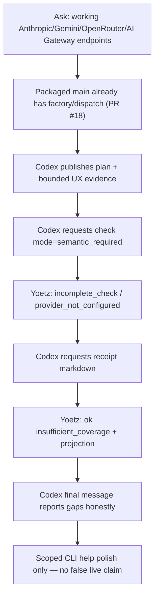

# Codex-testing + Yoetz provider-endpoints dogfood r4 (2026-07-25, post-PR #18)

**Date:** 2026-07-25  
**Codex model / effort:** `gpt-5.6-luna` @ `high`  
**Codex session / thread ID:** `019f98c7-a63c-7d51-a890-7fc698f1ed9d`  
**Repository baseline packaged:** `abbfd247` (`main`, merge of PR #18
`fix/r2-dogfood-product-gaps`)  
**Experiment branch (local preserve; do not merge for this wrap-up):**
`codex/provider-endpoints-20260725-luna-high-r4` @ `38eda37`  
**Related intake:** GitHub [issue #15](https://github.com/TheGaySupreme123/yoetz/issues/15)
(reused; progress comment; no PR — design gate still open)  
**Prior reports:**
[`2026-07-24-codex-testing-provider-endpoints.md`](2026-07-24-codex-testing-provider-endpoints.md)
(r1),
[`2026-07-24-codex-testing-provider-endpoints-r2.md`](2026-07-24-codex-testing-provider-endpoints-r2.md)
(r2),
[`2026-07-22-codex-testing-yoetz-activation.md`](2026-07-22-codex-testing-yoetz-activation.md),
[`2026-07-22-codex-testing-yoetz-second-dogfood-analysis.md`](2026-07-22-codex-testing-yoetz-second-dogfood-analysis.md)

**Aborted prior attempt (r3):** same product ask on `gpt-5.6-luna` @ `light` from
`fix/r2-dogfood-product-gaps` @ `2c049e0` failed immediately on
`usage_limit_exceeded` (no MCP, no code). Artifacts remain under
`/tmp/codex-provider-endpoints-20260724-luna-light-r3/` for quota evidence only.

## Purpose and limits

This document preserves evidence from the **2026-07-25** multi-agent dogfood
(Codex interact + independent review + Yoetz health) after PR #18 landed the
r2 postmortem product-gap fixes (receipt projection, semantic-mode selection,
provider factory/presets) on `main`. The small Codex UX delta stays on a
**separate local branch** and is **not** merged into `main` as part of this
wrap-up.

Limits: live semantic review still could not run in the Codex-testing
environment (`provider_not_configured`). “Working endpoints” here means
factory/dispatch wiring already on packaged `main`, plus clearer setup/help —
not a live multi-provider smoke with real API keys.

## Executive finding

**Yoetz cooperative path healed relative to r2; the product ask is largely
already satisfied on packaged `main`; Codex’s r4 delta is small UX polish.**

1. Fresh wheel from `abbfd247` installed cleanly (digest matches r3 packaging
   tip; differs from r2).
2. Codex used Yoetz end-to-end (`start` / `status` / `publish_work` / `check` /
   `receipt`) and finished exit `0` in ~8.5 minutes.
3. **`check`:** one recovered `FRONTIER_CONFLICT`, then **ok** with verdict
   `incomplete_check`. Both check requests used **`mode=semantic_required`**
   (unlike r2’s all-`deterministic_only`). Semantic status:
   `not_configured` / `provider_not_configured` — honest gap, not a silent
   clean pass.
4. **`receipt`:** **1/1 ok** with conclusion `insufficient_coverage`,
   `format=markdown`, and agent-context privacy projection populated —
   **no** r2-style `SERVICE_UNAVAILABLE`.
5. Independent review (**approve**): PR #18 already wires Anthropic/Gemini/
   OpenRouter → Chat Completions factory and OpenAI/Fireworks/Vercel →
   Responses factory. Codex correctly avoided re-shipping r1/r2 presets-only
   work and only clarified CLI help/prompts (+39/−12 across 6 files).

**Yoetz → Codex influence (one line):** Yes, and **for the better** — Yoetz
drove semantic-mode selection, returned a usable receipt that constrained
completion honesty, and steered Codex away from over-claiming while allowing a
scoped UX fix on top of an already-wired main.

---

## 1. How to get all raw local data

### Handoff (Agent 1)

```bash
less $HOME/yoetz-core/.codex-test-handoff.md
less /tmp/codex-provider-endpoints-20260725-luna-high-r4/meta.txt
less /tmp/codex-provider-endpoints-20260725-luna-high-r4/codex-test-handoff.md
```

`.codex-test-handoff.md` is gitignored — path only; do not commit it on `main`.

### Codex-testing session / rollout JSONL

| Artifact | Absolute path |
| --- | --- |
| Full rollout session | `$HOME/.codex-testing/sessions/2026/07/25/rollout-2026-07-25T13-17-28-019f98c7-a63c-7d51-a890-7fc698f1ed9d.jsonl` |
| Exec JSONL (`--json`) | `/tmp/codex-provider-endpoints-20260725-luna-high-r4/exec-20260725T101722Z.jsonl` |
| Exec stderr | `/tmp/codex-provider-endpoints-20260725-luna-high-r4/exec-20260725T101722Z.stderr` |
| Last message | `/tmp/codex-provider-endpoints-20260725-luna-high-r4/last-message-20260725T101722Z.txt` |
| Prompt | `/tmp/codex-provider-endpoints-20260725-luna-high-r4/prompt.txt` |
| Launch meta | `/tmp/codex-provider-endpoints-20260725-luna-high-r4/meta.txt` |
| Exit code | `/tmp/codex-provider-endpoints-20260725-luna-high-r4/meta-exit.txt` (`0`) |
| Codex home / config | `$HOME/.codex-testing/` · `config.toml` |

```bash
less $HOME/.codex-testing/sessions/2026/07/25/rollout-2026-07-25T13-17-28-019f98c7-a63c-7d51-a890-7fc698f1ed9d.jsonl
less /tmp/codex-provider-endpoints-20260725-luna-high-r4/exec-20260725T101722Z.jsonl
cat /tmp/codex-provider-endpoints-20260725-luna-high-r4/last-message-20260725T101722Z.txt
cat $HOME/.codex-testing/config.toml
CODEX_HOME=$HOME/.codex-testing $HOME/.local/bin/codex-testing mcp list
rg -n '"tool": "check"|semantic_required|incomplete_check|insufficient_coverage|SERVICE_UNAVAILABLE|FRONTIER_CONFLICT' \
  /tmp/codex-provider-endpoints-20260725-luna-high-r4/exec-20260725T101722Z.jsonl
# confirm model/effort from turn_context
rg -n 'turn_context|gpt-5.6-luna|"effort"|reasoning_effort' \
  $HOME/.codex-testing/sessions/2026/07/25/rollout-2026-07-25T13-17-28-019f98c7-a63c-7d51-a890-7fc698f1ed9d.jsonl \
  | head -40
```

### Agent 3 Yoetz health notes

```bash
less /tmp/codex-provider-endpoints-20260725-luna-high-r4/agent3-yoetz-health.md
less /tmp/codex-provider-endpoints-20260725-luna-high-r4/agent3-mcp-final-summary.json
less /tmp/codex-provider-endpoints-20260725-luna-high-r4/agent3-baseline.txt
less /tmp/codex-provider-endpoints-20260725-luna-high-r4/agent3-mcp-live-snapshot.json
less /tmp/codex-provider-endpoints-20260725-luna-high-r4/agent3-pytest-receipt-slice.txt
```

### Agent transcripts / subagent logs

Parent conversation:
`$HOME/.cursor/projects/Users-shayb-yoetz-core/agent-transcripts/80553304-25f3-4c69-b6ac-9d7e6663692e/`

| Role | Subagent transcript |
| --- | --- |
| Agent 1 (Codex setup/interact) | `.../subagents/e18b6544-48f5-4767-9a1f-9f2febde7e1d.jsonl` |
| Agent 2 (code/conversation review) | `.../subagents/7763facd-454a-4025-9879-b7d0c7056d04.jsonl` |
| Agent 3 (Yoetz health) | `.../subagents/050af7eb-8dbf-4d20-b0c9-a0a0defcda3c.jsonl` |

```bash
ls -lt $HOME/.cursor/projects/Users-shayb-yoetz-core/agent-transcripts/80553304-25f3-4c69-b6ac-9d7e6663692e/subagents/
```

### Git experiment branch (inspect without merging)

```bash
cd $HOME/yoetz-core
git log --oneline main..codex/provider-endpoints-20260725-luna-high-r4
git show --stat 38eda37
git diff main...codex/provider-endpoints-20260725-luna-high-r4 --stat
git diff main...codex/provider-endpoints-20260725-luna-high-r4
```

- **Branch:** `codex/provider-endpoints-20260725-luna-high-r4`
- **Preserve commit:** `38eda37` (*feat: enhance CLI help documentation with reviewed provider presets and wire styles*)
- **Base:** `main` @ `abbfd247`
- **Do not merge** into `main` as part of this dogfood wrap-up (report-only on main).
- Prior local experiment snapshots: `…-luna-high` @ `9c7ad2b`, `…-luna-high-r2` @ `fbca21c`,
  `…-luna-light-r3` (clean / no code after quota fail).

### Installed Yoetz path / version / wheel SHA

| Item | Value |
| --- | --- |
| CLI | `$HOME/.local/bin/yoetz` → uv tool env |
| Version | `0.1.0` |
| Wheel | `$HOME/yoetz-core/dist/yoetz-0.1.0-py3-none-any.whl` |
| Wheel SHA-256 | `5554cffc3ce13acf6972e6154c57dce9aa976bafa2f03c883bac08c28ec96ad2` |
| Install | `uv tool install … "yoetz[semantic-openai] @ ./dist/yoetz-0.1.0-py3-none-any.whl"` |
| Python | `3.14.6` (managed) |
| Resource manifest digest | `sha256:afd57bccb3c76801419ce9a543ef19e51a219a42c0925cca1d4dcbc990a92708` |
| Packaged from | `abbfd247` (`main` / PR #18) |
| vs r2 digest | **CHANGED** (`sha256:5ed7963…bcc3c0`) |
| vs r3 digest | **SAME** (PR #18 merged the r3 packaging tip) |

```bash
yoetz --version
yoetz version --json
shasum -a 256 $HOME/yoetz-core/dist/yoetz-0.1.0-py3-none-any.whl
yoetz service status --json
yoetz integrate codex mcp status --codex-path $HOME/.local/bin/codex-testing
CODEX_HOME=$HOME/.codex-testing $HOME/.local/bin/codex-testing mcp list
```

**Important:** the installed wheel is the packaged `main` tip used during the
Codex session. The experiment branch’s +39/−12 CLI help delta is **not** in that
wheel unless reinstalled from `38eda37`. Factory/dispatch for the asked
providers lives on packaged `main` (PR #18), not only on the experiment branch.

---

## 2. Findings (synthesis across agents)

### Agent 1 — Codex interact (success)

- Packaged/installed Yoetz `0.1.0` from `main` @ `abbfd247`; configured
  `codex-testing` for `gpt-5.6-luna` @ **high** (restored from r3’s light);
  created `codex/provider-endpoints-20260725-luna-high-r4`; ran the same
  provider-endpoints ask as r1/r2.
- Codex reused **issue #15**, commented progress, implemented a **6-file**
  help/prompt clarity slice (+39/−12), claimed focused tests + Ruff + Pyright,
  **did not open a PR** (design gate), later preserved as commit `38eda37` on
  the experiment branch only.
- Yoetz MCP usable end-to-end: recovered malformed `start`/`publish_work`,
  **`check` → `incomplete_check`**, **`receipt` → `insufficient_coverage`**.

### Agent 2 — Review (verdict: **approve**)

- Product ask for working multi-provider endpoints is **already met on
  packaged main** via PR #18 factory composition (`external_factory_builders_from_config`
  / Chat Completions vs Responses mapping).
- r4 Codex delta is discoverability-only (CLI help, prompts, one subprocess
  help test + owning specs) — not a re-ship of r1/r2 presets-only registries.
- Process/honesty good: no secrets; no over-claim of live interoperability;
  Yoetz semantic gap and receipt conclusion reported accurately.
- Non-blocking nit: `specs/src/yoetz/cli/app.md` slightly overclaims root-help
  wire-style naming; endpoint help + test cover the intended clarity.

### Agent 3 — Yoetz health (verdict: **healthy**, improved vs r2)

- Install/CLI/MCP config healthy on digest `afd57bcc…`.
- Live Codex→Yoetz: receipt projection **fixed**; semantic-mode path
  **exercised**; no material regression of the post-PR#17 check
  `INTERNAL_ERROR` fix.
- Focused receipt wording/projection pytest slice: **11 passed**.

### Cross-run comparison

| Layer | r1 (`23e188f`) | r2 (`586c486`) | r3 (quota) | r4 (`abbfd247`) |
| --- | --- | --- | --- | --- |
| Activation / `start` | works after recovery | works after recovery | not exercised | works after recovery |
| `publish_work` | accepted | accepted | — | accepted (after invalids + 1 `INTERNAL_ERROR`) |
| `check` | **`INTERNAL_ERROR`** | **`no_issue_detected` ×3** (`deterministic_only`) | — | **`incomplete_check`** (`semantic_required`) |
| Semantic mode | n/a / broken check | **never requested** | — | **`semantic_required` ×2** |
| `receipt` | blocked | **`SERVICE_UNAVAILABLE` ×5** | — | **ok `insufficient_coverage` ×1** |
| Implementation vs ask | setup presets only | same setup only | none | **factory on main** + UX polish |
| Review verdict | request changes | request changes | blocked (quota) | **approve** |

### What specifically changed in Yoetz (vs r2 postmortem gaps)

PR #18 / packaged `main` addressed the r2 P0 themes in live behavior:

1. **Semantic-mode selection path works.** Codex requested `semantic_required`
   twice. Yoetz answered with structured `semantic_status=not_configured` and
   verdict `incomplete_check` instead of a complete-looking deterministic pass.
2. **Receipt projection works under agent-context.** Markdown receipt returned
   with `ok: true` and populated `privacy_projection` (`sink: agent_context`).
   No generic `SERVICE_UNAVAILABLE` collapse in this session.
3. **Provider factory composition exists on main.** Independent review confirmed
   Anthropic/Gemini/OpenRouter and Vercel AI Gateway mapping through production
   factory builders — the r1/r2 “presets without dispatch” gap is closed on the
   packaged baseline.
4. **Natural MCP ceremony remains brittle but recoverable.** Early
   `INVALID_REQUEST` / one `publish_work` `INTERNAL_ERROR` / one
   `FRONTIER_CONFLICT` still consumed retries; `status` recovery worked.



### MCP call counts (exec JSONL)

From `/tmp/codex-provider-endpoints-20260725-luna-high-r4/exec-20260725T101722Z.jsonl`:

| Tool | Completed / failed (Agent 1 handoff) | Outcomes |
| --- | ---: | --- |
| `yoetz.start` | 2 | 1× `INVALID_REQUEST`, 1× ok `created` |
| `yoetz.status` | 2 | 2× ok |
| `yoetz.publish_work` | 6 | 3× ok `accepted`; 2× `INVALID_REQUEST`; 1× `INTERNAL_ERROR` |
| `yoetz.check` | 2 | 1× `FRONTIER_CONFLICT`; 1× ok `incomplete_check` (`semantic_required`) |
| `yoetz.receipt` | 1 | **1× ok `insufficient_coverage`** (`rcp_b59d6192-…`) |

Task `tsk_ecb96379-14ae-4119-a9ad-2b0b4366d0cd`; session
`ses_0711f641-af8d-4eff-887b-f1dab7993c97`.

---

## 3. Yoetz influence on Codex

### Did Yoetz actually change anything?

**Yes — process, verification mode, completion honesty, and implementation
scope.** Stronger causal influence than r2.

Evidence Yoetz **did** reshape behavior (better):

1. **Verification mode changed vs r2.** Exec JSONL shows both completed/failed
   checks carried `mode=semantic_required`. r2’s three successful checks were
   all `deterministic_only`. That is a material change in what Codex asked Yoetz
   to do, and it matches the r2 postmortem’s required fix (“prefer semantic for
   material implementation asks”).
2. **Verdict shape constrained claims.** Instead of r2’s clean
   `no_issue_detected` on metadata-only publications, r4 returned
   `incomplete_check` with an explicit semantic gap
   (`provider_not_configured`). Codex’s last message quotes that limitation and
   does **not** invent a full semantic endorsement.
3. **Receipt returned and was used.** Codex obtained a durable receipt
   conclusion (`insufficient_coverage`) and reported it. In r2, five receipt
   attempts failed closed as `SERVICE_UNAVAILABLE`, so completion was ungated by
   receipt content. Here receipt content is visible in the final answer.
4. **Implementation scope narrowed appropriately.** Review found Codex treated
   factory/dispatch on main as already done and only clarified setup/help.
   Yoetz publications + check/receipt ceremony supported that honesty (plan →
   bounded evidence → incomplete semantic → insufficient coverage) rather than
   pushing another large presets-only rewrite.
5. **Recovery loop still works.** After malformed Yoetz args and a frontier
   conflict, Codex used `status` and retry rather than abandoning cooperative
   verification.

Evidence of **limits** (Yoetz did not fully “solve” the ask alone):

- Semantic review could not execute (`provider_not_configured` in the
  Codex-testing MCP runtime), so Yoetz could not independently grade live
  provider interoperability.
- Early `INVALID_REQUEST` / transient `INTERNAL_ERROR` still show ceremony
  friction; influence required recovery, not a first-try clean path.
- The product win on factory wiring is primarily **already on main from PR
  #18**, not invented by this Codex session. Yoetz’s contribution here is
  steering and honesty around that baseline, plus enabling Codex to stop at UX.

### Better or worse?

| Aspect | Direction vs r2 | Notes |
| --- | --- | --- |
| Activation + ledger publication | **Same / still good** | Cooperative path remains usable |
| `check` availability | **Sustained good** | No r1 `INTERNAL_ERROR`; recovered frontier conflict |
| Semantic selection/guidance | **Better** | `semantic_required` actually requested; incomplete verdict instead of false-clean deterministic pass |
| `receipt` | **Better (healed)** | Usable markdown + projection; no `SERVICE_UNAVAILABLE` |
| Process honesty | **Better** | Final message mirrors check/receipt gaps; no fabricated receipt |
| Code quality vs ask | **Better product state** | Factory on main; r4 delta is UX only (approve) |
| Risk of false confidence | **Lower** | `incomplete_check` + `insufficient_coverage` are hard to misread as full endorsement |
| Natural MCP ergonomics | **Still imperfect** | Invalids / one publish INTERNAL_ERROR / frontier conflict remain |

**Bottom line:** Yoetz **did change Codex’s behavior**, and the change was
**net better** — especially versus r2’s combination of weak verification mode +
broken receipts + setup-only code. Yoetz still cannot complete a live semantic
provider review without a configured semantic provider in the testing home.

---

## 4. How Yoetz worked in this run

### Packaging / install

```bash
cd $HOME/yoetz-core
git fetch origin && git checkout main && git pull --ff-only origin main
# HEAD == abbfd247b6a38e6589395f982eeea0fc8fcbfa16
rm -rf dist && uv build --no-sources
uv tool install --managed-python --python 3.14.6 --force --reinstall \
  "yoetz[semantic-openai] @ ./dist/yoetz-0.1.0-py3-none-any.whl"
```

Succeeded. Freshness confirmed by digest change vs r2 and identity with the
pre-merge r3 packaging tip. Package semver remains `0.1.0`.

### Service / MCP ownership

- Codex config `[mcp_servers.yoetz]` → `yoetz mcp serve` (enabled).
- Isolated `CODEX_HOME=$HOME/.codex-testing`; model `gpt-5.6-luna`,
  `model_reasoning_effort=high`; no credentials copied from `~/.codex`.
- Agent 3: CLI help OK; supervisor not required for MCP-only dogfood;
  `codex-testing mcp list` shows Yoetz enabled.

### Succeeded

- Install + CLI identity on the PR #18 wheel.
- Live MCP: session create, recovered status, accepted publications.
- Live MCP: **`check` closed** with structured incomplete semantic result.
- Live MCP: **`receipt` delivered** with usable conclusion and projection.
- Codex completion honesty aligned with Yoetz outputs.
- Agent 3 receipt projection/wording tests: 11 passed.

### Failed / incomplete / friction

- Semantic evaluator **not configured** in Codex-testing → no semantic findings
  beyond the configuration gap.
- Natural agent payloads still produce `INVALID_REQUEST` and occasional
  `FRONTIER_CONFLICT` / publish `INTERNAL_ERROR` before recovery.
- Experiment UX commit is **not** in the installed wheel used during the run
  (wheel = packaged main tip).
- Observation/hooks consent was not the steering path; explicit MCP was.

### Experiment code disposition

Preserved on local branch `codex/provider-endpoints-20260725-luna-high-r4` @
`38eda37` (6-file CLI help/prompt clarity). **Not merged to `main`** in this
wrap-up. Suitable as optional UX follow-up once issue #15 has maintainer
acknowledgement; **not** required to claim factory-level multi-provider setup on
current `main`.

---

## Evidence authority order used

Conclusions prefer: ADRs / specs for intended product boundaries; Agent 3
CLI/MCP probes and pytest for runtime health; exec/rollout JSONL for what Codex
actually called (especially `semantic_required` and receipt success); Agent 2
review for code honesty vs ask and factory presence on main; Agent 1 handoff for
packaging/session metadata. No conclusion relies only on Codex’s final answer
where logs or independent probes contradict it.
